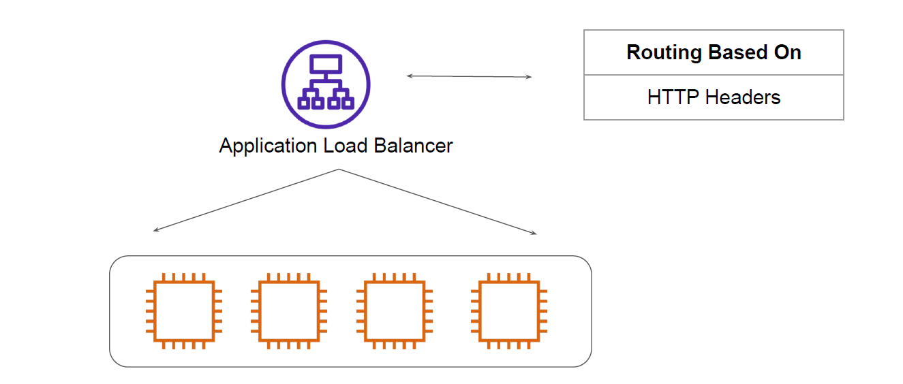
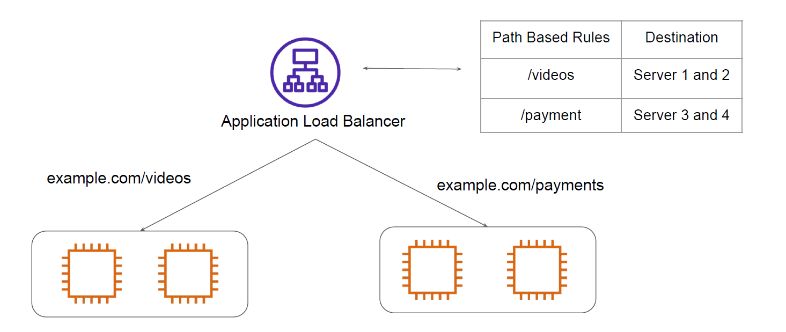
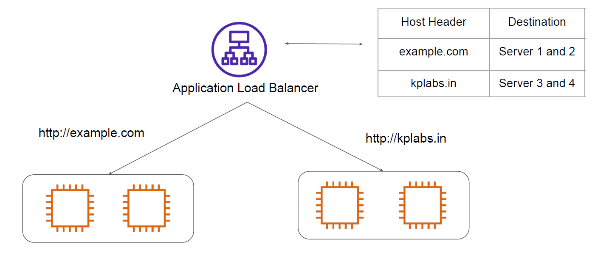

# Application Load Balancers

"Next generation load balancers"

## Basics of HTTP Headers

HTTP headers let the client and the server pass additional information with an HTTP request
or response.

## Understanding ALB

Application Load Balancer functions at Application layer and support both HTTP & HTTPS

## Path Based Routing

The request are routed based on the URI path.

## Routing Using Host Headers

The request are routed based on the Host Header

