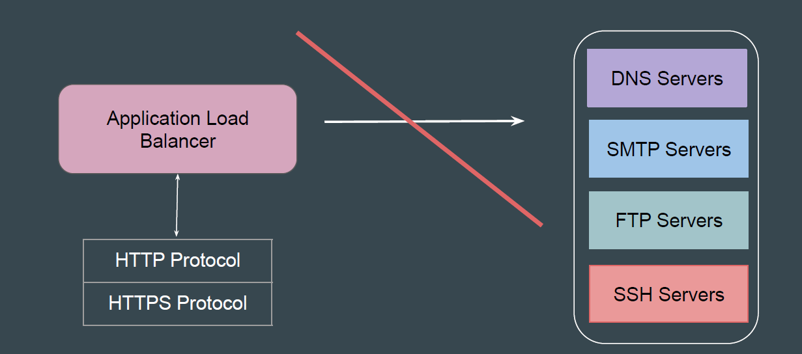
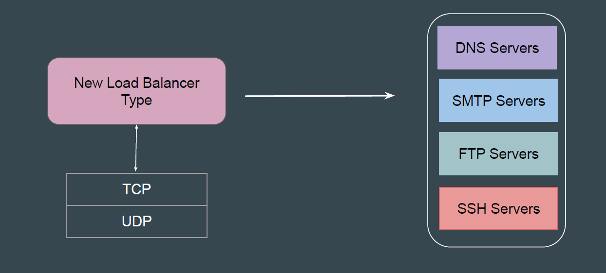
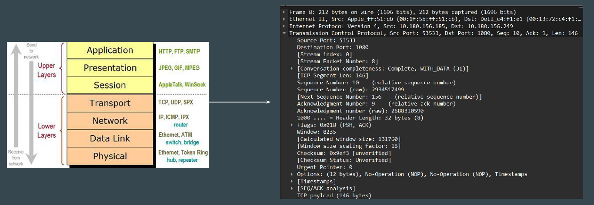
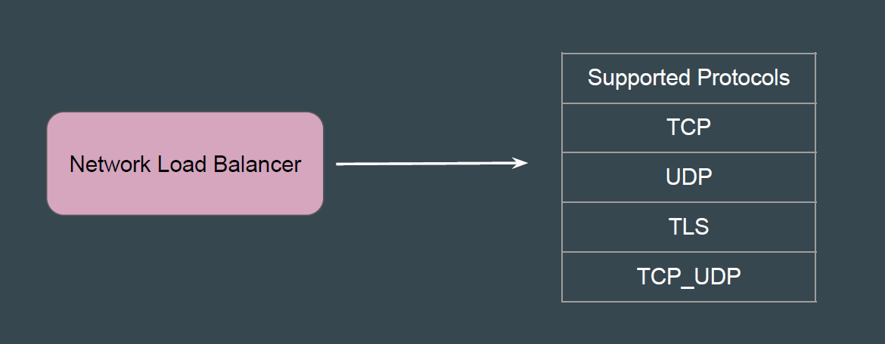
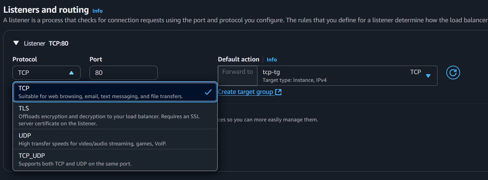

# Network Load Balancers

## Setting the Base

Not ALL applications support HTTP protocol.
Example: DNS servers, SMTP server, FTP servers, SSH servers etc.

## Requirement of Additional Load Balancer Type

There is a requirement of additional load balancer types that works for
non-HTTP based protocols.

## Setting the Base

A Network Load Balancer operates at the layer 4 (Transport Layer) of the OSI
model.
It can handle millions of requests per second.

## Supported Protocols

Network Load Balancer target groups support following protocols.

## Reference Screenshot - Supported Protocols for NLB

## Points to Note

For TCP traffic, the load balancer selects a target using a flow hash algorithm
based on the protocol, source IP address, source port, destination IP address,
destination port, and TCP sequence number.

For UDP traffic, the load balancer selects a target using a flow hash algorithm
based on the protocol, source IP address, source port, destination IP address,
and destination port.
