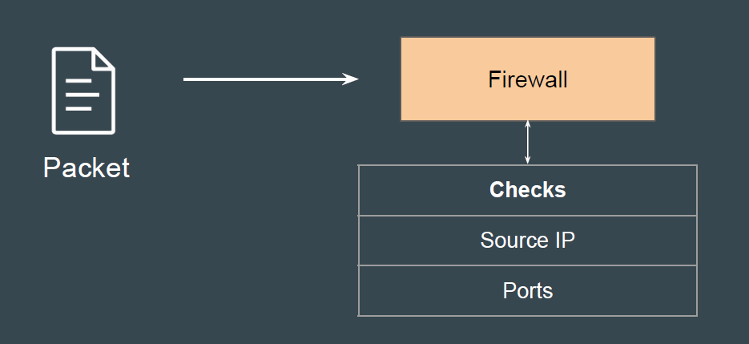
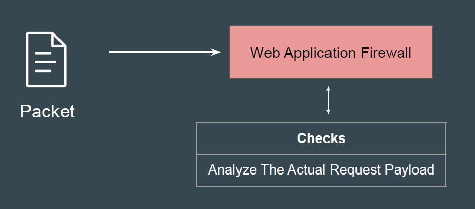
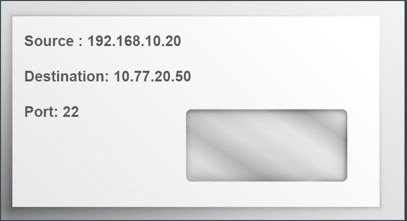
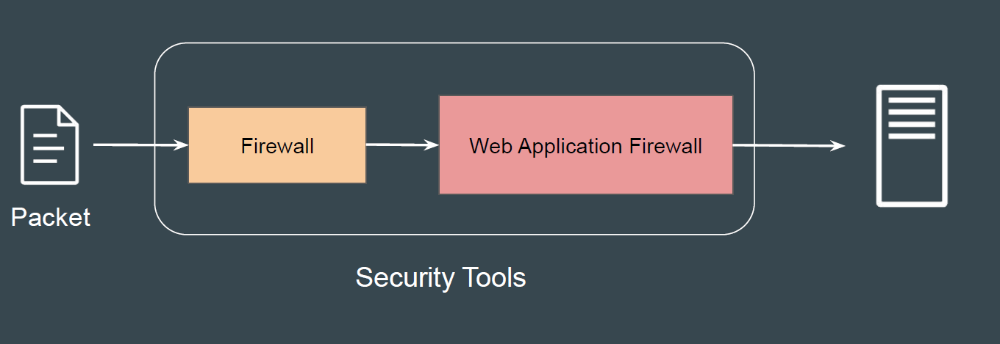
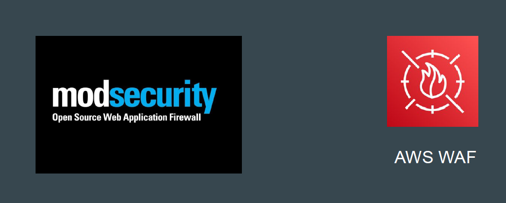

# Web Application Firewalls (WAF)

Simple Analogy
Imagine a security guard letting everyone into a concert as long as the ticket is
valid.
He does not check what they're bringing inside their bags.
If someone brings in something dangerous hidden in their bag, the guard won’t
notice.

## Basics of Network-Level Firewalls

Network-level firewalls primarily checks the basic details like the (source IP)
and where they want to go (destination IP and port).
These firewalls don’t see inside the actual request.

## Web Application Firewall

A Web Application Firewall looks inside the web requests to identify the
malicious code in the web request.

## Example Analogy - Envelope

Network level Firewall reads the basic details from outside of envelope to finalize
however WAF opens the envelope and, analyzes the inner contents of the
envelope

## Workflow Architecture

In a typical architecture, you will use Firewall and WAF to analyze traffic before
sending it to the backend application.

## WAF Provider Offerings

Modsecurity is one of the very popular open source web application firewall.
There are various other popular offerings from CloudFlare, Akamai, AWS and
other providers.

