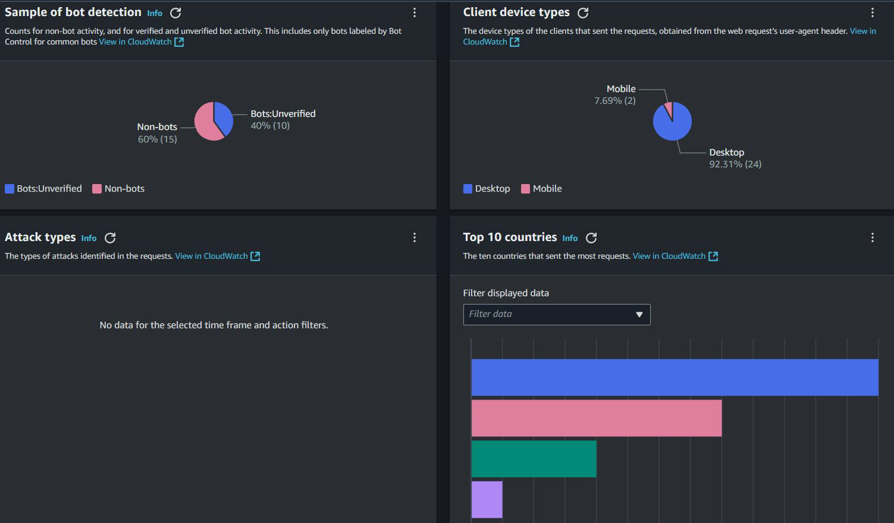
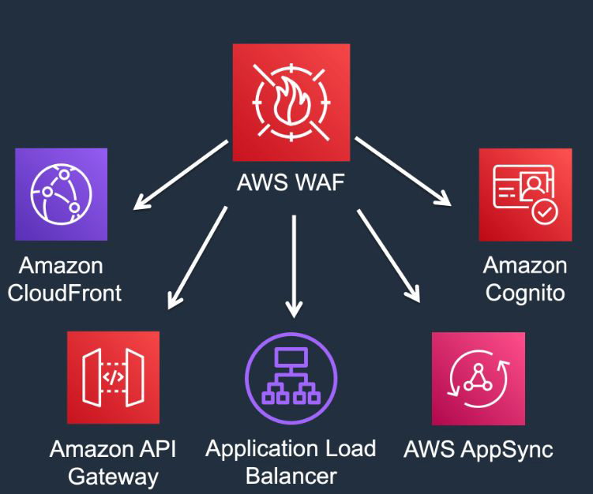
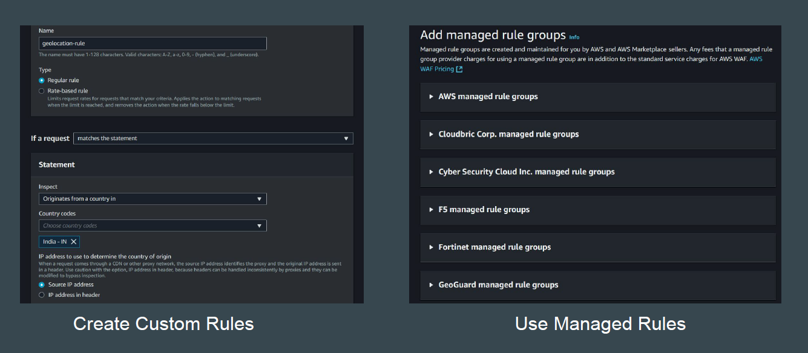

# AWS Web Application Firewall (WAF)

## Setting the Base

AWS WAF is a managed web application firewall offering.
It helps protect web applications from common web exploits that could affect and
compromise your application.

## Benefit of AWS WAF - Integrations

AWS WAF can easily be integrated with Application Load Balancers, API
Gateways, AWS CloudFront distributions and more, making it easy to deploy.

## Supported Resource Types

You can protect the following resource types using AWS WAF

1. Amazon CloudFront distribution

2. Amazon API Gateway REST API

3. Application Load Balancer

4. AWS AppSync GraphQL API

5. Amazon Cognito user pool

6. AWS App Runner service

7. AWS Verified Access instance

8. AWS Amplify

The list of integrations can be updated in the future as new ones are added
regularly.

## What about WAF Rules

You have option to either create your own WAF rules or you can use managed
rule sets that are available.

