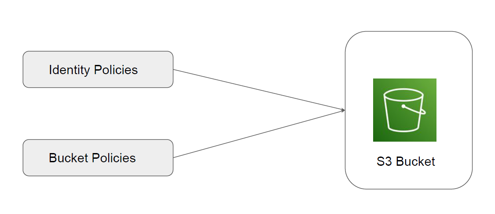
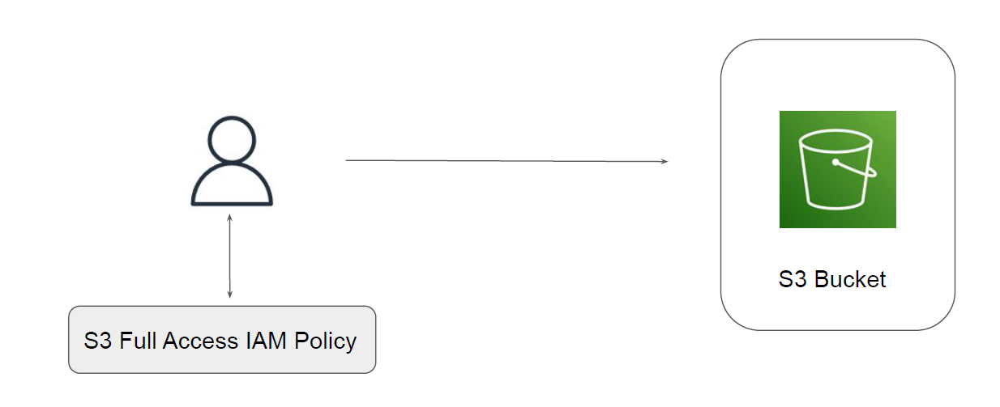
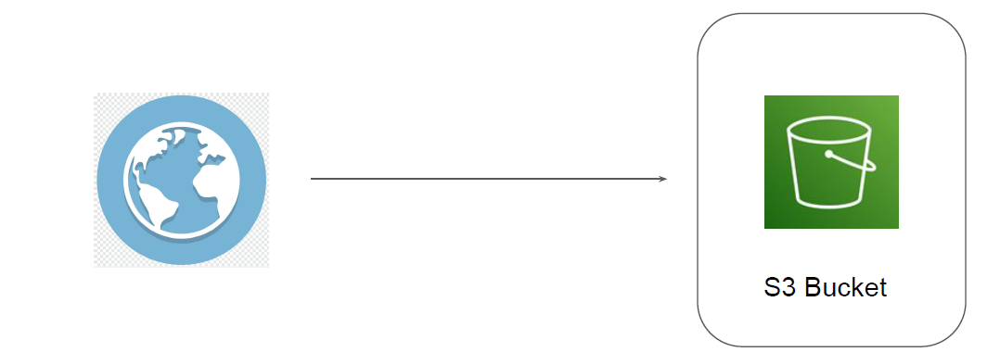
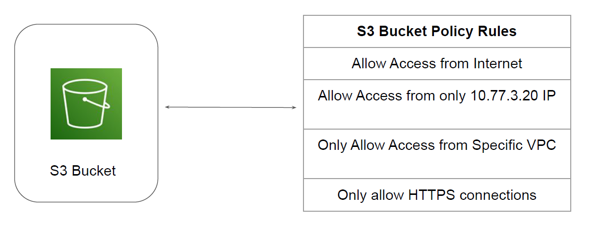
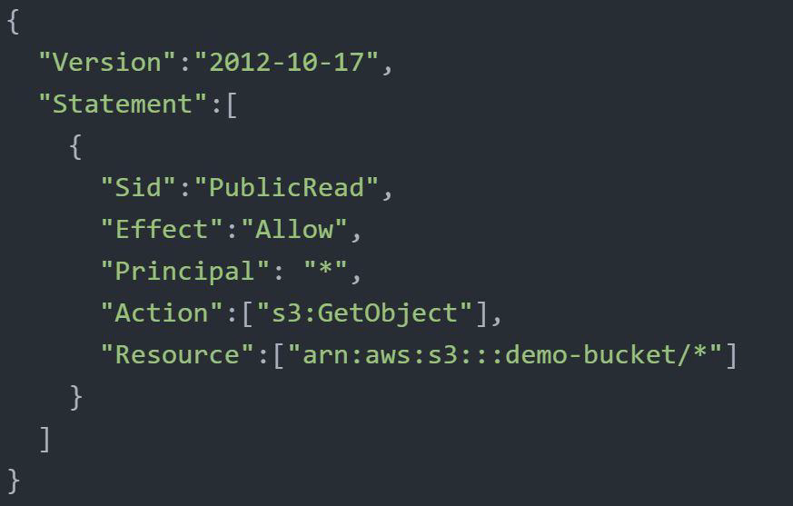
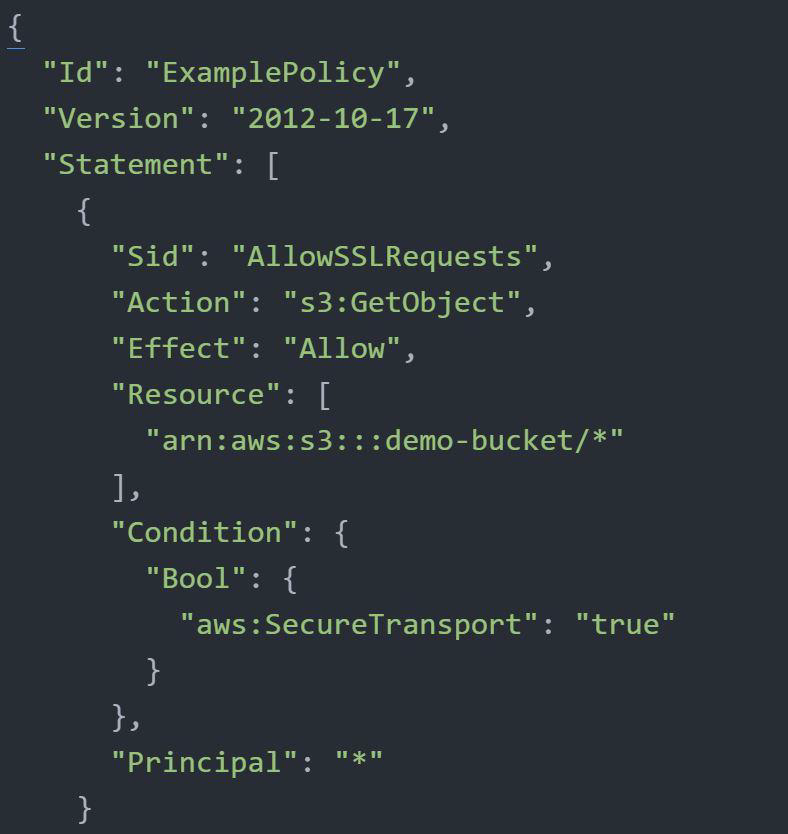

# S3 Bucket Policy

"Bucket Policies"

## Granting Permission for S3 Resource

There are two primary ways in which a permission to a S3 resource is granted.

## Use-Case 1: IAM User Needs Access to S3 Bucket

IAM User Named Bob needs Full Access to S3 Bucket.

## Wider Scope of S3 Bucket

Files within the S3 bucket can have scope beyond the IAM entity.
Organization can host entire websites in S3 Bucket.
S3 Buckets can even be used to host central files for download.

## S3 Bucket Policy

A bucket policy is a resource-based AWS IAM policy associated with the S3 Bucket to control
access permissions for the bucket and the objects in it .

## Bucket Policy 1 - Public Access

knowledge portal
The following example policy grants the s3:GetObject permission to any public anonymous
users.

## Bucket Policy 2 - Only HTTPS

Only the HTTPS requests should be allowed. All HTTP requests should be blocked.

