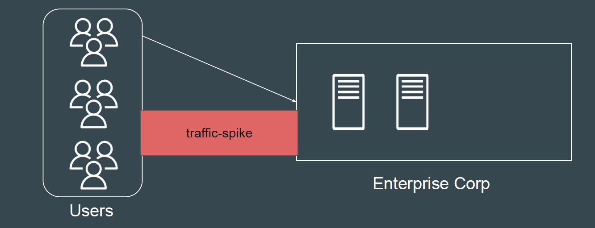
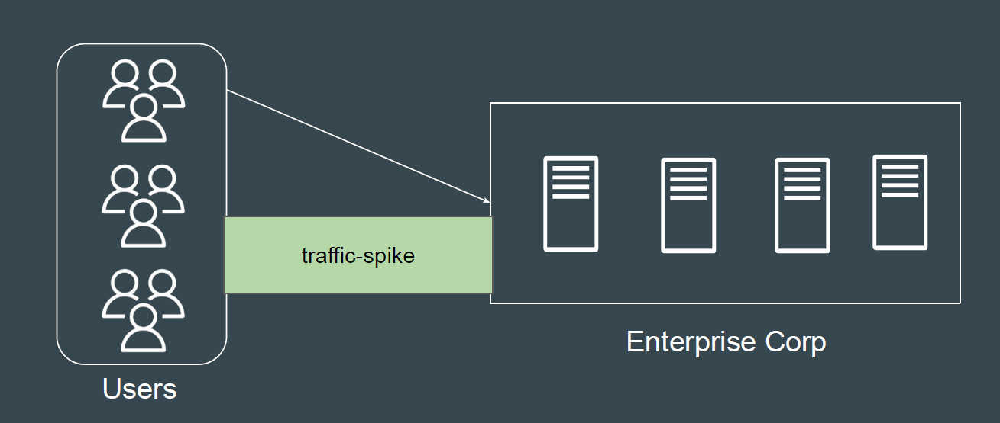
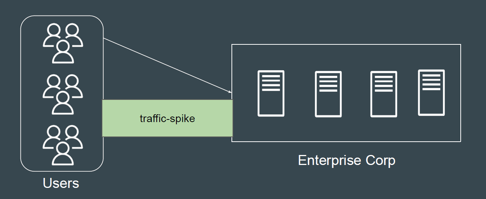
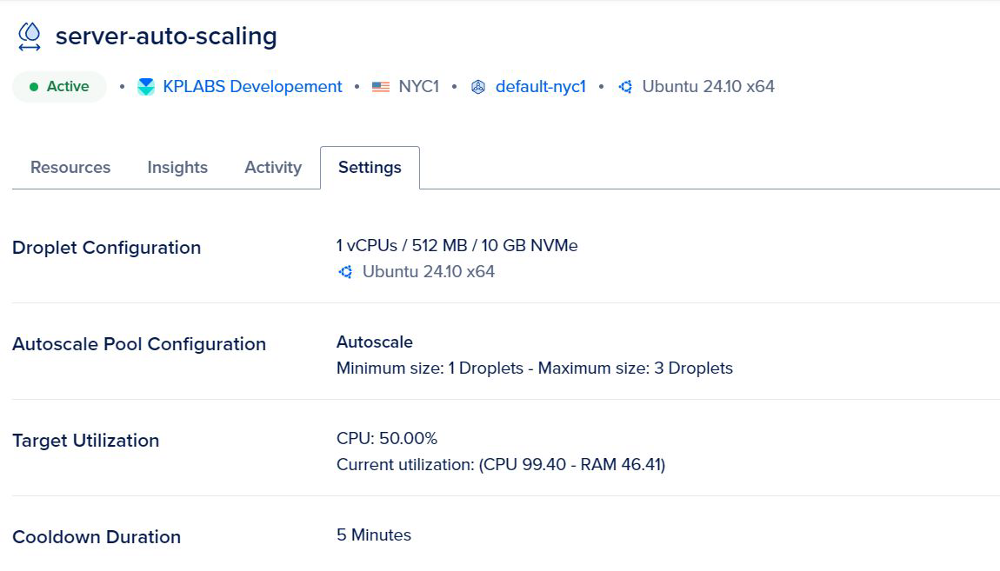
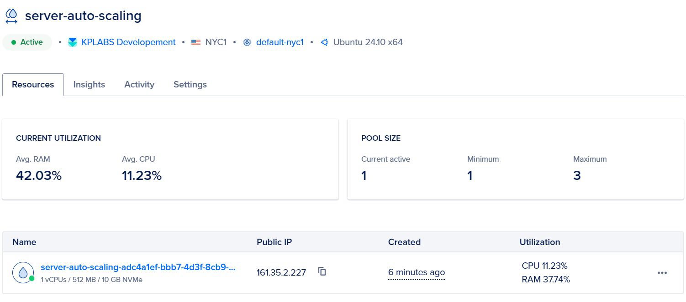
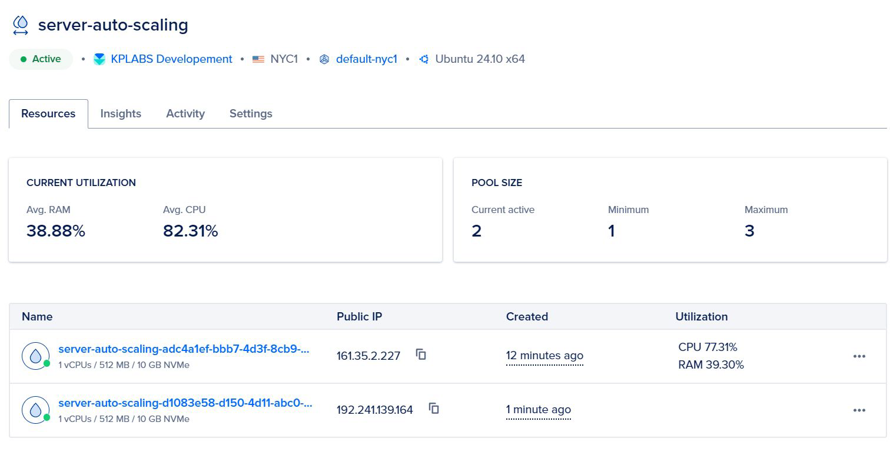
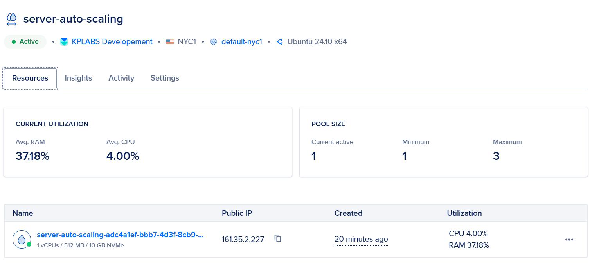
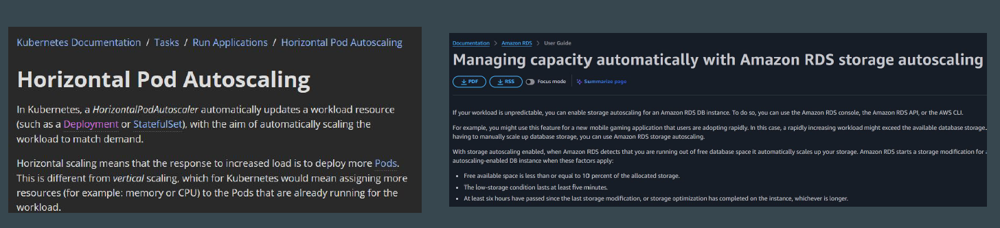

# Introduction to Auto-Scaling

## Setting the Base

Organizations usually provision a set number of servers to manage normal traffic
levels.
These servers can be inadequate during traffic spikes.

## Introducing Auto-Scaling

Auto-scaling is a feature that automatically adjusts the amount of computational
resources (like servers or containers) based on the current demand.

## Analogy of AC

You have an air conditioner at home that can automatically adjust its power
based on the room temperature.
When the room gets very hot , the AC senses the temperature and increases its
cooling power to bring the temperature down quickly.
When the room is already cool or fewer people are in the room, the AC slows
down or even turns off to save electricity.

## Auto-Scaling - Scale Down Operations

When the load on the server decreases, the scale-down operation occurs, and
additional servers are automatically terminated.

## Benefits of Auto-Scaling

Cost Efficiency - You only pay for what you use. No need to run expensive, idle
servers when demand is low.

Reduced Manual Intervention - No need for DevOps team to constantly monitor
and adjust resources; the system does it automatically.

Business Agility - You can easily handle growth or sudden changes in demand,
supporting promotions, product launches, or viral moments.

## Factors for Auto-Scaling

Resource Utilization - If CPU usage crosses a set threshold (e.g., 80%), add
more servers. If below 40%, remove additional servers.

Scheduled Scaling - Adding new servers every Monday at 9 AM for the weekly
rush, and removing additional servers at 6 PM.

Predictive or AI-Based Scaling - Using historical data and trends to scale in
anticipation of upcoming spikes.

## Reference Screenshot - Auto-Scaling Configuration

The following auto-scaling configuration has a minimum of 1 server and a
maximum of 3 servers. Target utilisation is 50% CPU

### Reference Screenshot - Normal Load

Under normal server load, there is only one server running.

### Reference Screenshot - Scale Up Operation

When the load increases (CPU utilisation), additional servers are launched

### Reference Screenshot - Scale Down Operation

When the load decreases(CPU utilisation), additional servers are terminated.

## Auto-Scaling Isn’t Just for Servers

Auto-scaling was primarily used for servers, but now with evolving technologies,
it’s also used for containers, storage, databases, and many more.

