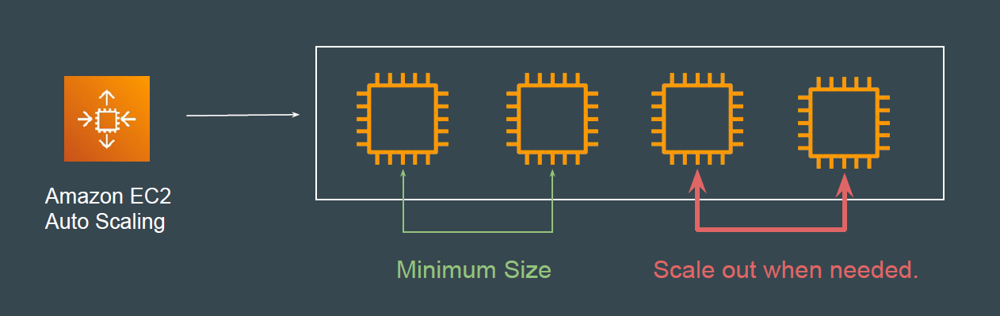
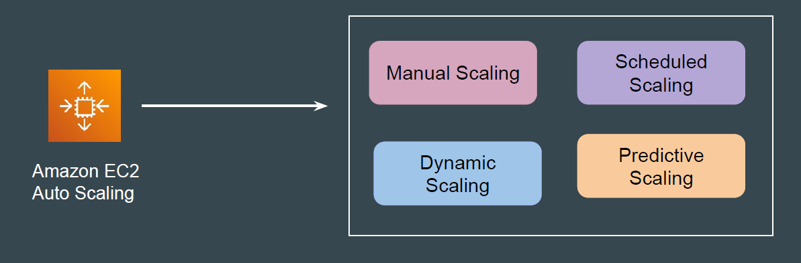

# Amazon EC2 Auto Scaling

## Introduction to the Topic

Amazon EC2 Auto Scaling enables you to automatically adjust the number of
Amazon EC2 instances in your application environment based on various
factors, such as load.

## Basics of Scaling

Scaling (Scalability) is the ability to increase or decrease the compute capacity
of your application.
Amazon EC2 Auto Scaling offers several methods to adjust scaling to best meet
the needs of your applications.

| Scaling Type         | Description |
|----------------------|-------------|
| **Manual Scaling**   | User manually adjusts the desired number of EC2 instances. |
| **Scheduled Scaling**| Scaling actions occur at specific times based on a schedule.    **Example:** Add instances at 8 AM and remove them at 6 PM every weekday. |
| **Dynamic Scaling**  | Automatically adjusts capacity in response to real-time application demand or CloudWatch alarms.    **Example:** Scale up when CPU exceeds 70% for 5 minutes. |
| **Predictive Scaling** | Uses machine learning to predict future traffic and adjusts capacity ahead of time. |
``
