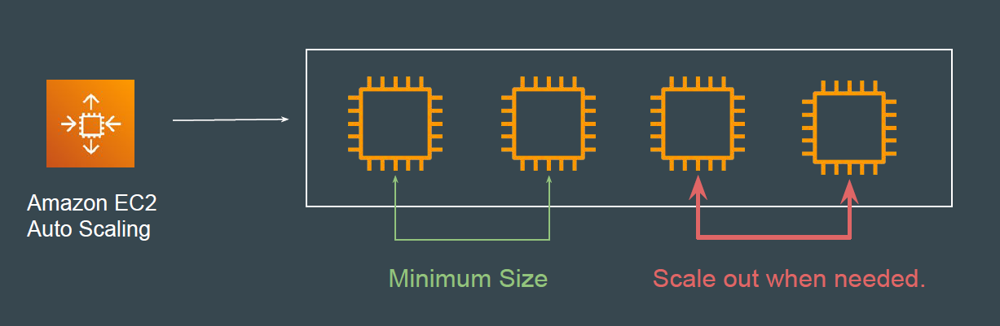
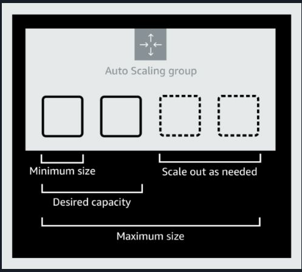
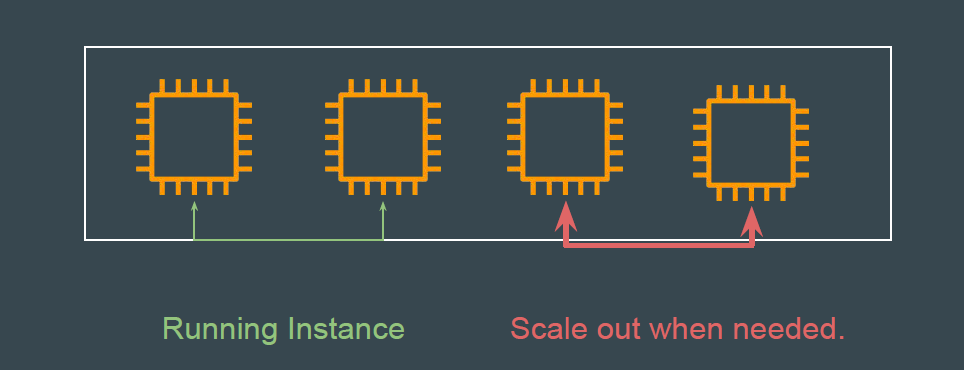
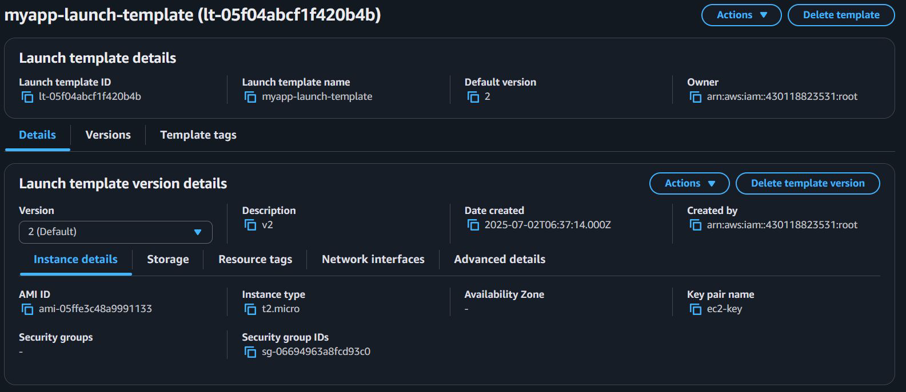
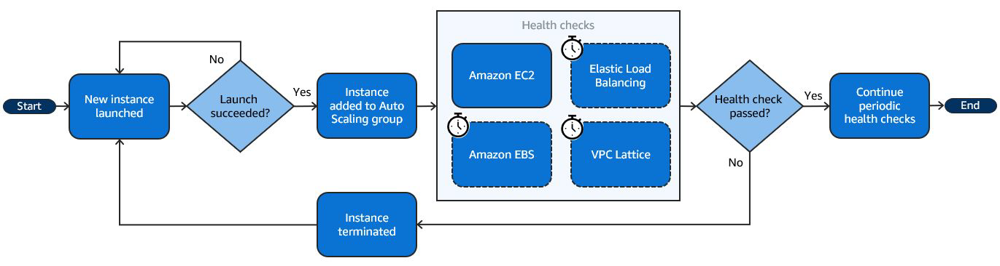

# Base Concepts - EC2 Auto Scaling

## Auto-Scaling Group

The Auto Scaling Group contains the rules and parameters (like scaling policies,
health checks, and instance specifications) that tell EC2 Auto Scaling how to
manage your instances.

## Capacity Management

| Setting  | Description |
|----------|-------------|
| Minimum  | Lowest number of instances that must always be running in your Auto Scaling Group. |
| Desired  | Target number of instances you want running under normal conditions. |
| Maximum  | Upper limit for how many instances the Auto Scaling Group can scale up to. |

## Example - Capacity Management

| Setting  | Description |
|----------|-------------|
| Minimum  | 1 |
| Desired  | 2 |
| Maximum  | 4 |

## Launch Template

Before you can create an Auto Scaling group, you must create a launch template
that contains the configuration information to launch an instance.

## Health Checks

Amazon EC2 Auto Scaling continuously monitors the health status of instances
in an Auto Scaling group to maintain the desired capacity.
When EC2 Auto Scaling determines that an InService instance is unhealthy, it
replaces it with a new instance to maintain the desired capacity of the group.

## Multiple Types of Scaling

| Scaling Type        | Description |
|--------------------|-------------|
| Manual Scaling     | User manually adjusts the desired number of EC2 instances. |
| Scheduled Scaling  | Scaling actions occur at specific times based on a schedule.  
Example: Add instances at 8 AM and remove them at 6 PM every weekday. |
| Dynamic Scaling    | Automatically adjusts capacity in response to real-time application demand or CloudWatch alarms.  
Example: Scale up when CPU exceeds 70% for 5 minutes. |
| Predictive Scaling | Uses machine learning to predict future traffic and adjusts capacity ahead of time. |
