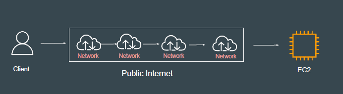
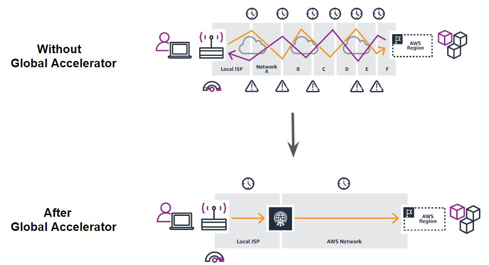
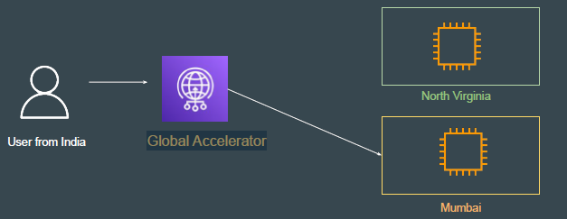
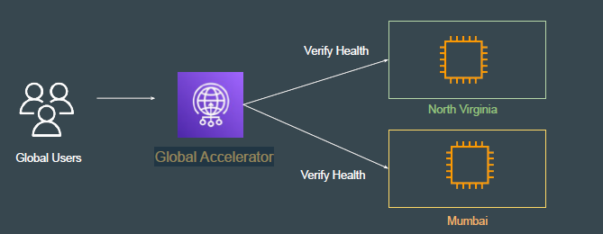
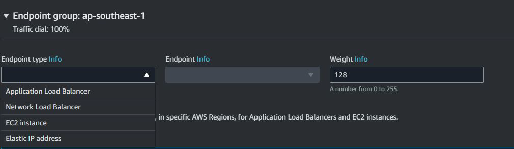

# AWS Global Accelerator

## Understanding the Challenge

Public networks, such as the public internet, can be congested.
Each hop between and within public networks can introduce performance risks.

### How can I test how many hops to destionation?

- in windows use command "tracert <destination address/ip address>"

- in linux use command "tracerout <destination address/ip address>"

- you can also use online website such as <https://traceroute-online.com/>

## Introducing Global Accelerator

AWS Global Accelerator is a service in which you create accelerators to improve
the performance of your applications for local and global users.
Traffic travels over the well-monitored, congestion-free, redundant AWS global
network to the endpoint

## Standard Workflow

Global Accelerator can have multiple set of endpoints across regions.
Standard accelerators automatically route traffic to a healthy endpoint that is
nearest to your user.

## Health Check Options

Global Accelerator can also continuously monitors the health of all endpoints, and instantly begins directing traffic for all new connections to another available endpoint when it determines that an active endpoint is unhealthy.

### test connection

if you want to test connection while using AWS Global Accelator you can use "curl" command or use <https://reqbin.com/curl>

## Support Endpoints

Supported Endpoints: ALB, NLB, EC2, and Elastic IP addresses.

## Points to Note

AWS Global Accelerator can detect an unhealthy endpoint and take it out of
service in less than one minute.
Can integrate with AWS Shield for DDoS protection.

## AWS Global Accelerator Speed Comparison

This tool compares Global Accelerator to the public internet. Choose a file size to see the time to download a file from application endpoints in different AWS Regions to your browser.

<https://speedtest.globalaccelerator.aws/#/>

## AWS Global Accelerator pricing

<https://aws.amazon.com/global-accelerator/pricing/?refid=3b902fe0-bcdd-4075-a945-dc3bb06c6c64>
