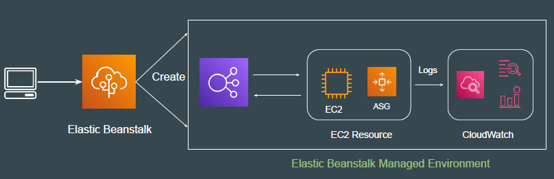
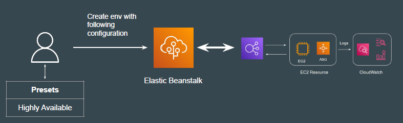
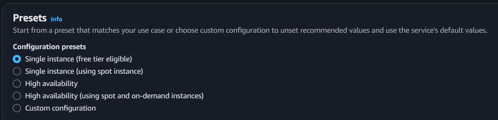
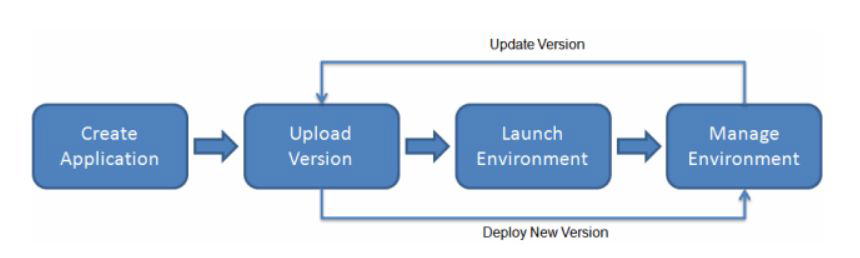

# Elastic Beanstalk

## Traditional Approach

Use-Case: Deploy a simple Hello World application for production.
Resources to be created: AWS EC2, ELB, Auto-Scaling, CloudWatch,
Web-Server Configuration, and others.

## Elastic Beanstalk Approach

Use-Case: Deploy a simple Hello World application for production.
Solution: Create Elastic Beanstalk Environment with correct configuration.

## Introducing Elastic Beanstalk

With AWS Elastic Beanstalk, you simply upload your application, specify the presets and platform type, and Elastic Beanstalk automatically handles the details of capacity provisioning, load balancing, scaling, and application health monitoring.

## Environment Presets

You can choose among wide range of presets to launch environments based on
your requirement.

## Practical Workflow

## AWS Elastic Beanstalk Pricing

There is no additional charge for AWS Elastic Beanstalk. You pay for AWS resources (e.g. EC2 instances or S3 buckets) you create to store and run your application. You only pay for what you use, as you use it; there are no minimum fees and no upfront commitments.

The costs of running a web site using Elastic Beanstalk can vary based on several factors such as the number of Amazon EC2 instances needed to handle your web site traffic, the bandwidth consumed by your application, and which database or storage options your application uses. The principal costs for a web application will typically be for the Amazon EC2 instance(s) and for the Elastic Load Balancing that distributes traffic between the instances running your application.
