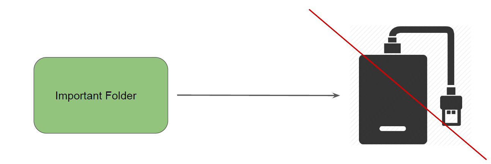
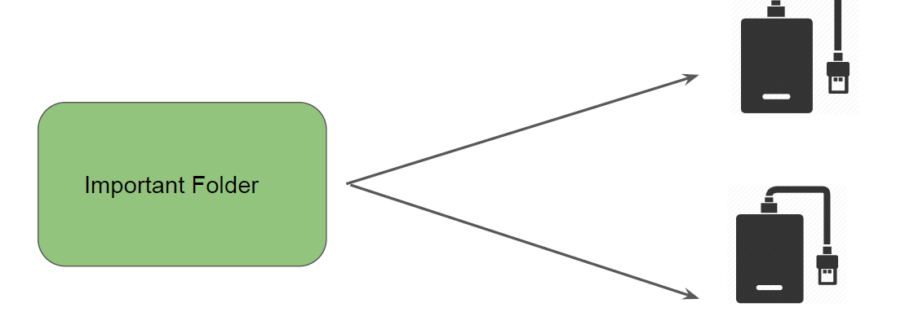
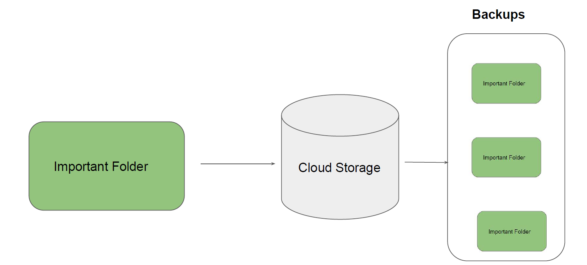
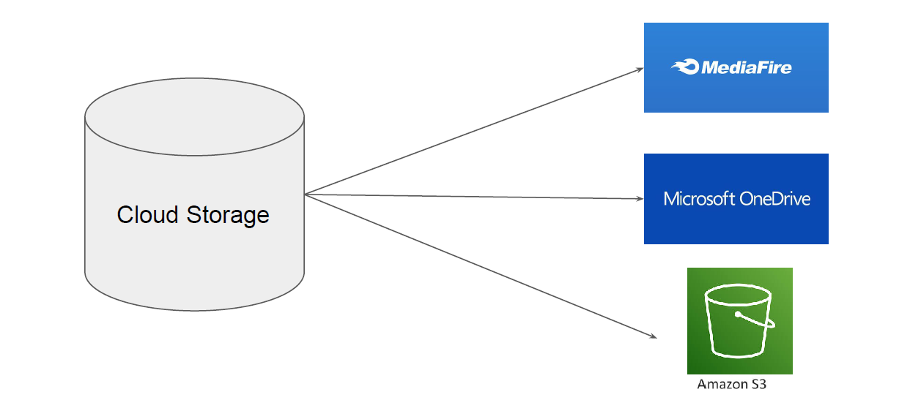
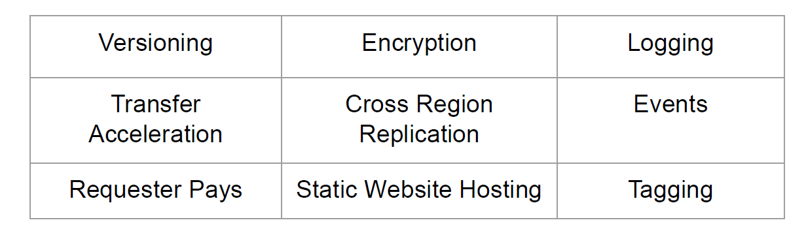
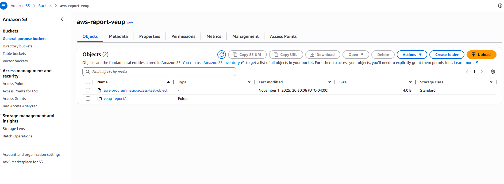

# AWS Simple Storage Service (S3)

"Unlimited Storage"

## Use Case - Storage Capacity

We all have some important data that needs to be reliably stored.
Most of us decides to store our data in external hard disk drives as a backup.

## Better Approach

In this approach, we decide to replicate the data in two different hard disk drives.
Downside:

- Expensive Approach,
- 
- If you keep these disk in same location, there is a risk.

## Best Approach

In this approach, we store the data in Cloud and let Cloud provider take care of backups.

## Cloud Storage Providers

There are multiple Cloud storage providers that are available.
Depending on your use-case, you can select one among them.

## Introduction to S3

- AWS Simple Storage Service (S3) is an object storage designed to store and retrieve any
amount of data from anywhere

- It is designed for 99.999999999% durability and 99.99% availability.
- 
- The aspect that makes AWS S3 so powerful are it’s associated features.

## S3 Terminology

There are two important terminology in AWS S3 :

- Buckets
- Objects
Important Note: Bucket Names are unique across entire AWS Namespace.

