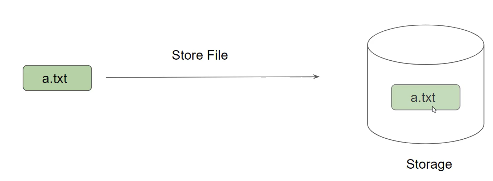
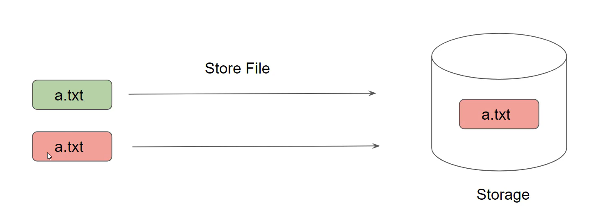
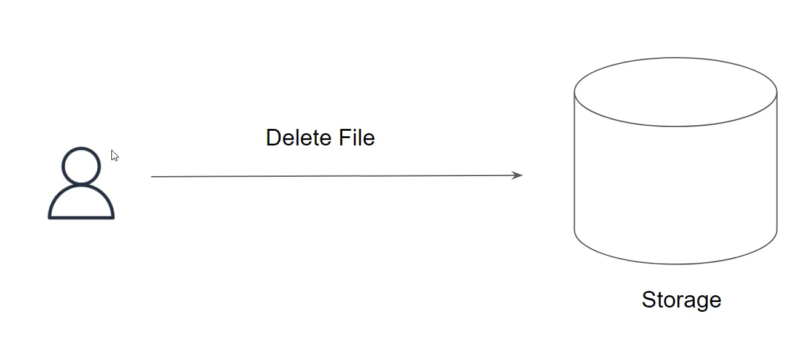
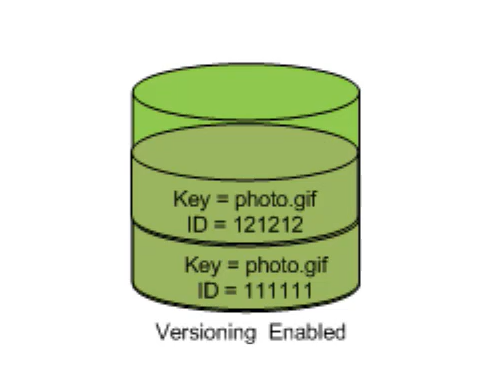

## Versioning in Object Storage

Versioning allows users to keep multiple variants of an object in the same S3 bucket.

You can use versioning to preserve, retrieve, and restore every version of every object stored in your Amazon S3 bucket.

## Challenge 1- Multiple Object with Same key

 

## Challenge 2- Accidental Deletion of Objects

## Important Pointers for Versioning

- Once versioning is enabled on a bucket, it can never return to an unversioned state. You can, however, suspend versioning on that bucket.

- The versioning state applies to all objects in the bucket (never just some of them).

