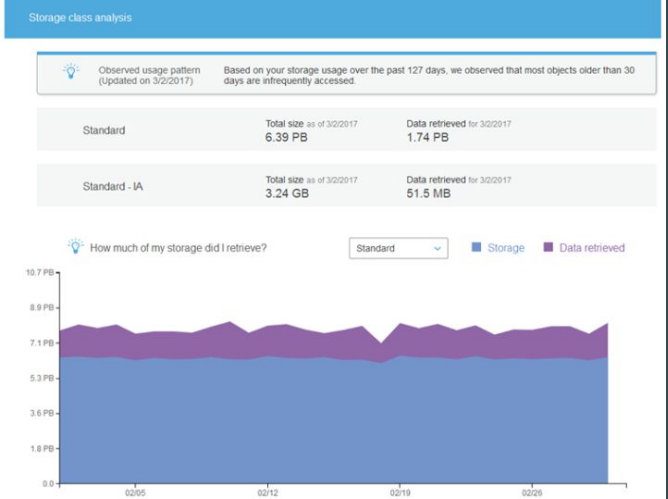

# S3 Storage Class Analysis

By using Amazon S3 analytics Storage Class Analysis you can analyze storage
access patterns to help you decide when to transition the right data to the right
storage class.

This will help you tune your lifecycle policies.

## Points to Note
Storage class analysis only provides recommendations for Standard to Standard
IA classes.

Does not provide recommendation for Glacier.

Offers option to create CSV report

You can also export this daily usage data to an S3 bucket and view them in a
spreadsheet application, or with business intelligence tools, like Amazon
QuickSight.
