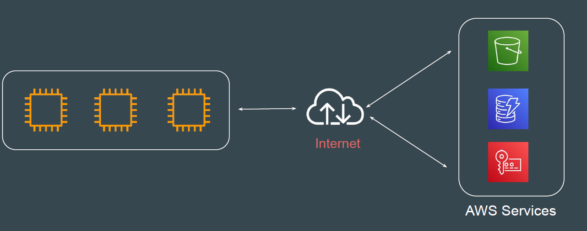
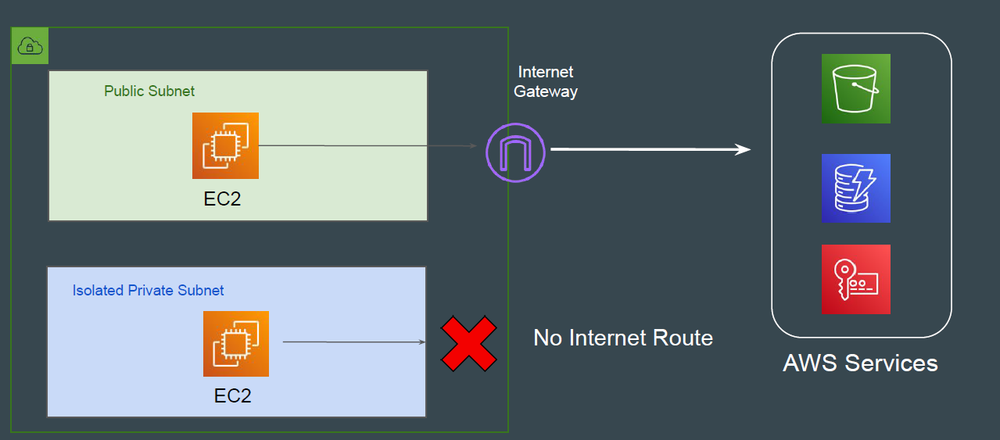
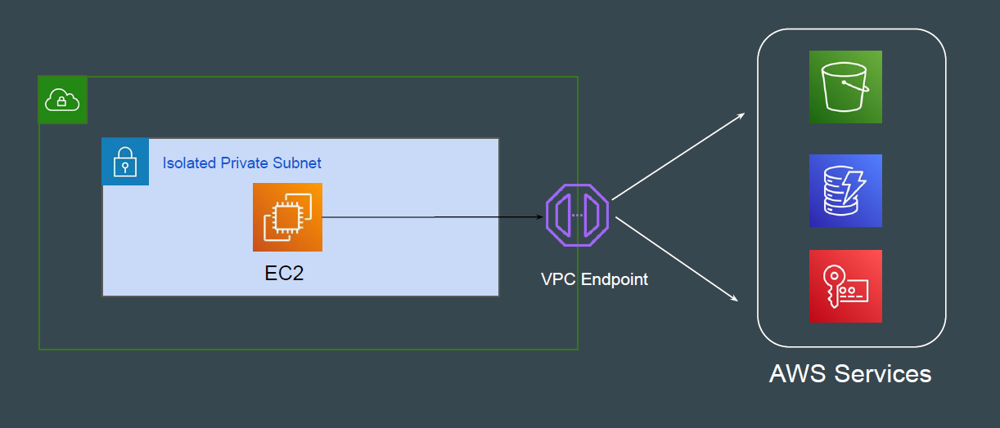
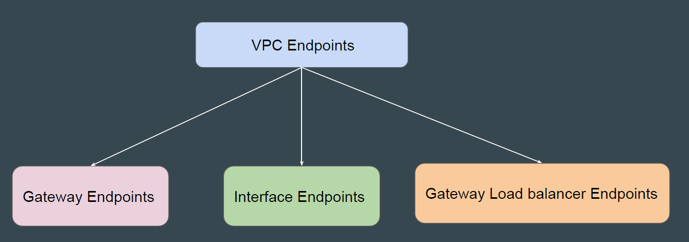

# VPC Endpoints

## Understanding the Challenge

For EC2 instances to be able to connect to other AWS services, the traffic had to
flow via the Internet.

## Challenge with Private Workloads

For sensitive workloads that DO NOT Internet connectivity, it becomes a big
challenge.

## Main Challenge & Customer Demand

If ALL the resources are hosted in AWS, why do they need Internet for
communication between each other?

Customer needs a way in which the communication between AWS services can
happen privately through AWS Network.

This can lead to better security, lower latency and lower cost.

## Downsides of Public Internet

1. Data Transfer Cost of AWS

2. Higher Latency

3. Can bottleneck your Internet Gateway.

4. Security

## Introducing VPC Endpoints

VPC Endpoints allows us to connect VPC to another AWS services OR other
supported services over AWS private network.

## Types of VPC Endpoints

There are three primary types of VPC Endpoints that are available

