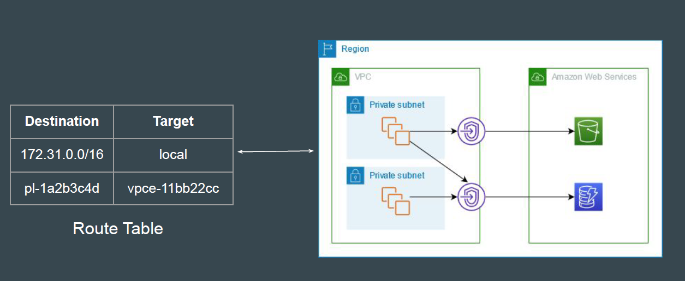
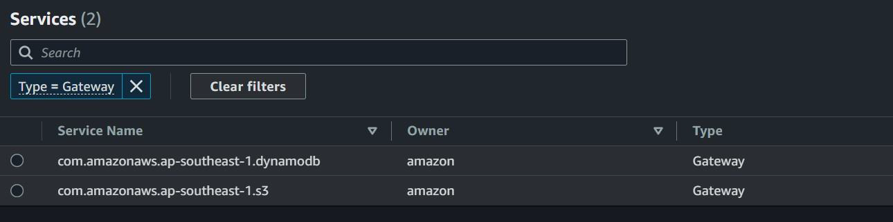
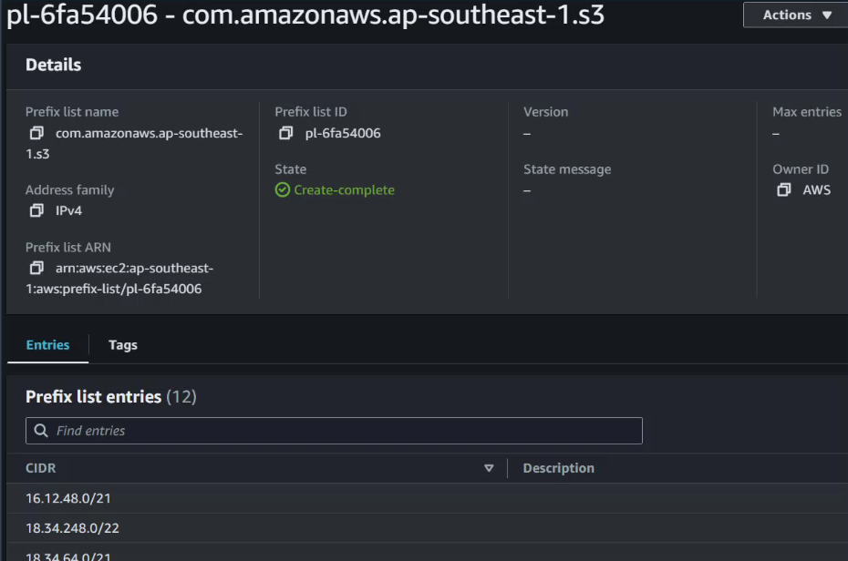

# Gateway VPC Endpoints

## Gateway Endpoints Architecture

A gateway endpoint targets specific IP routes in VPC route table, in the form of a
prefix-list, used for traffic destined to DynamoDB or S3.

## Supported Services

Gateway VPC Endpoints supports only S3 and DynamoDB Service.

## Prefix list for Endpoint

This prefic list contain all the CIDR ranges related to S3 service for the region to automatically route the traffic via the Gateway endpoint.

