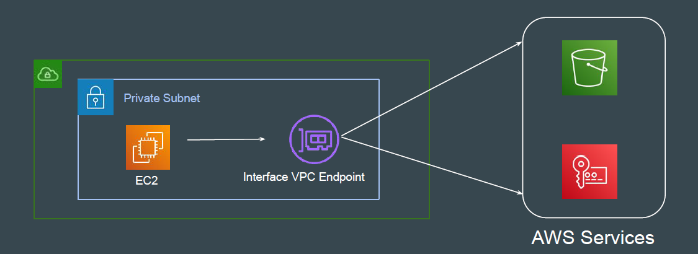
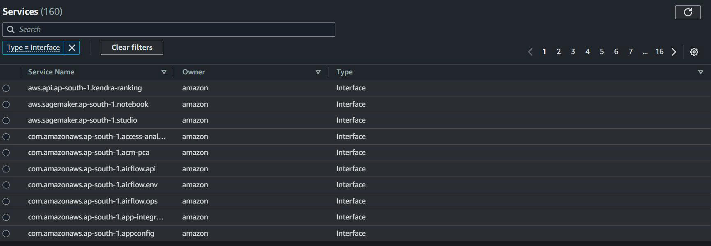
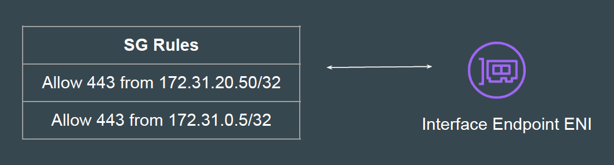
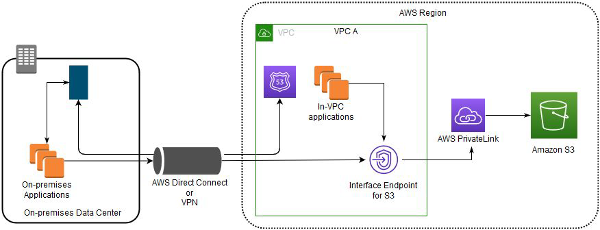

# Interface Endpoints

## Basic Architecture

An interface endpoint is an ENI with a private IP address from the IP address
range of your subnet.
The ENI serves as an entry point for traffic destined to a supported AWS service
or a VPC endpoint service.

## Supported Services

Unlike Gateway VPC Endpoints, the Interface Endpoints supports lots of
services.

## Security Group Integration

Since the Interface Endpoints uses ENI, you can associate a security group to it.
This allows customers to restrict access to endpoint based on their
requirements.

## On-Premise Support

Since Interface Endpoints creates an Elastic Network Interface inside the VPC,
the on-premise systems can connect to it via VPN and Direct Connect.

