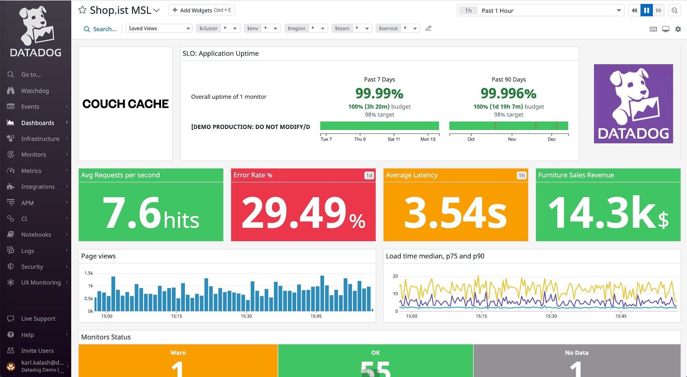
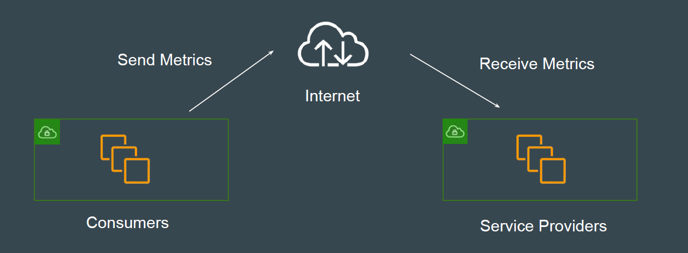
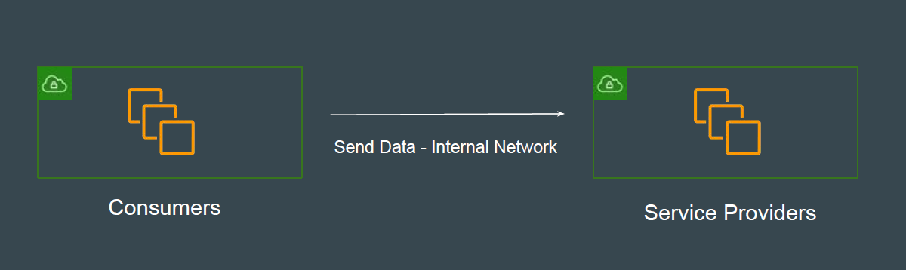
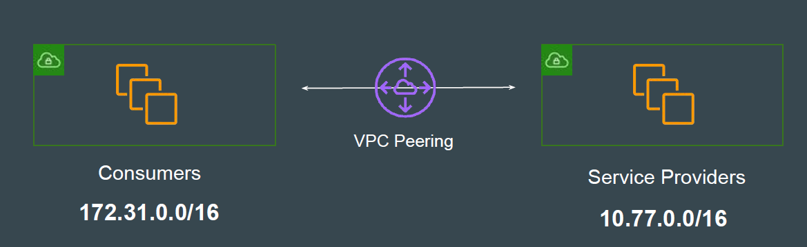
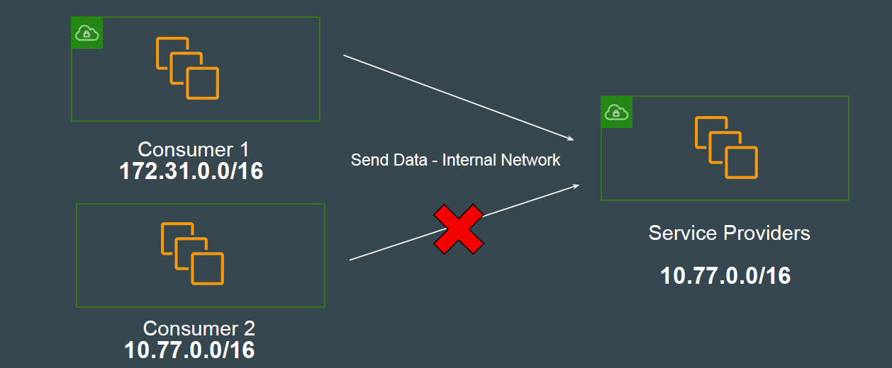
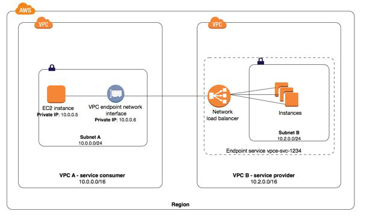

# VPC Endpoint Services

## Understanding the Basics

Organizations widely use many 3rd party solutions like Data Dog, New Relic etc
to create dashboards related to systems / application performance.
To create such dashboards, organization has to send appropriate metrics to 3rd
party servers.

## Understanding the Challenge

These system and applications metrics are generally sent via the Internet to 3rd
Party service provider servers.

## Better Solution - Internal Network

If both Consumers and Service Providers are hosted in AWS, these metrics can
be sent via AWS Private Network instead of the Internet.
This can provide many advantages related to cost, latency, and security.

## Possible Approach - VPC Peering

In this approach, the Consumer and Service Provider VPC can establish VPC
Peering and data can then be sent over Internal Network.

## VPC Peering is Not Practical

A Service provider can have thousands of customers.
There will be CIDR overlapping issues.

## Consumer Requirements

Consumer and Service Provider VPC should be able to communicate with each
other through AWS Internal Network without worrying about CIDR overlaps

## Introducing VPC Endpoint Services

Using Interface Endpoints, AWS allows connecting to the Service Provider VPC
The traffic flows through AWS Private Network.

