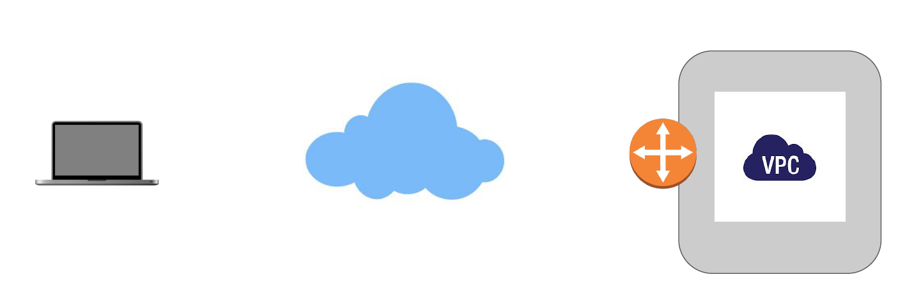
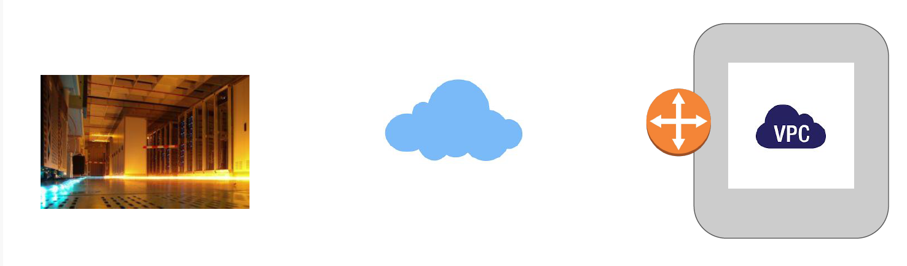
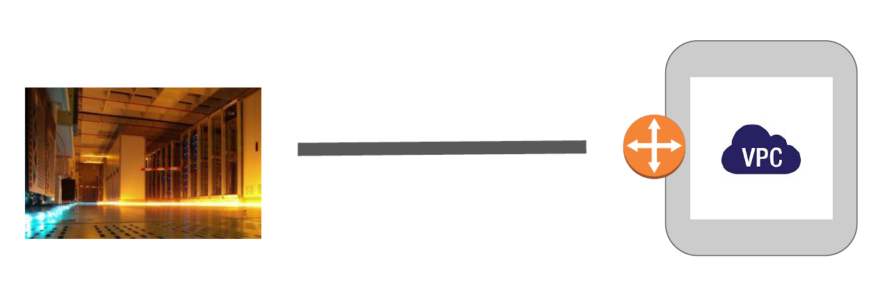
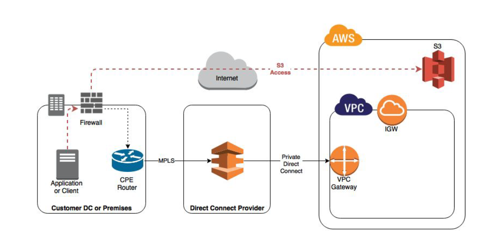

# Direct Connect

"Let’s Route Centrally"

## Customer to VPC

## Challenges

- Internet is a good option if amount of traffic is within a certain limit.

- There are always latencies which can also be involved.

- Many of the organization have hybrid architecture : DataCenter + AWS

- In such cases, latency can cause major challenges for the application

## Introducing DX

- In order to solve this challenge, AWS introduced Direct Connect.

- AWS Direct connect let’s customer establish a dedicated direct network connection
   between the client’s network and one of the direct connect locations.

## Benefits of DX

Having direct connection between customer’s datacenter to AWS, brings tremendous amount
of benefits, some of them includes:

- Consistent Network Performance:

- Reduces our bandwidth costs

- Private connectivity to our AWS VPC

## Architecture of DX

