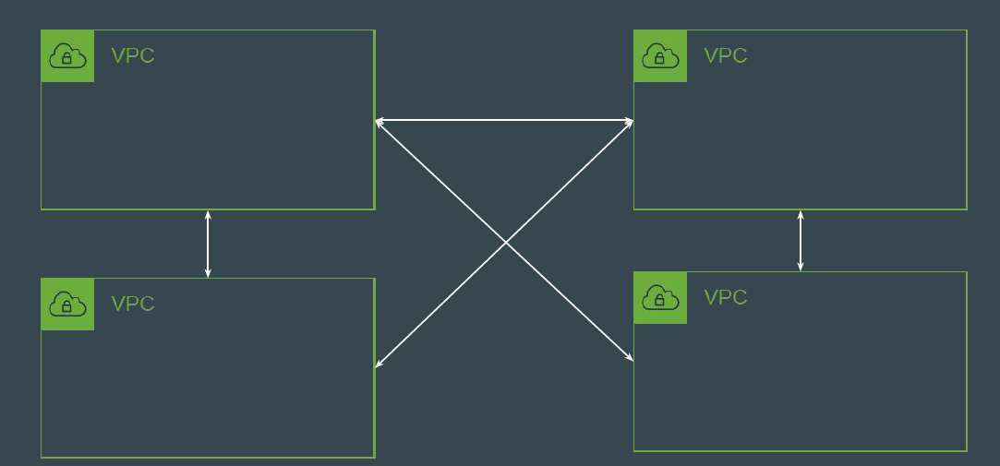
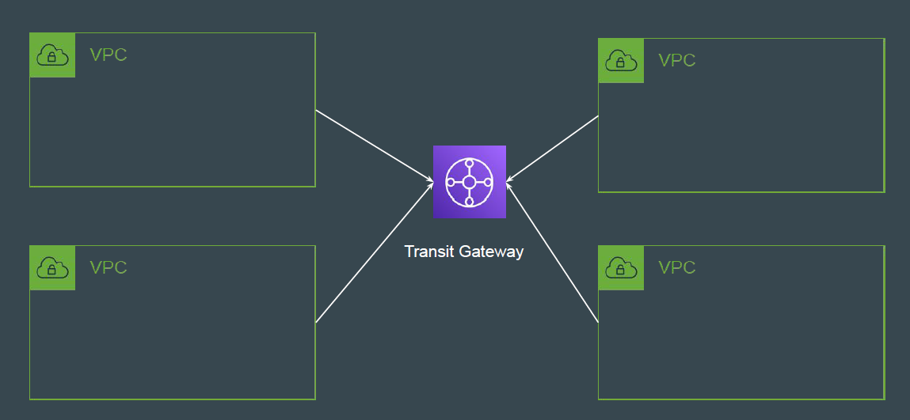
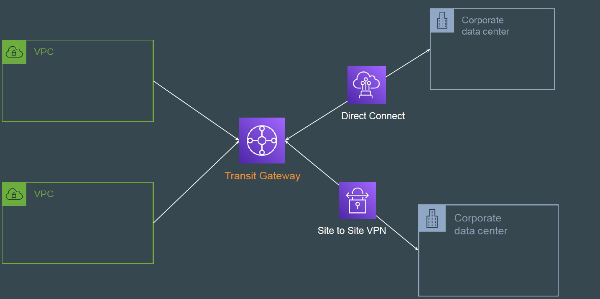

# Transit Gateways

## Use-Case: Connecting 4 VPCs

More the Number of VPCs, more the number of peering connection you have to
establish for inter-connectivity related use-case.

## Introducing Transit Gateway

AWS Transit Gateway connects your Amazon Virtual Private Clouds (VPCs)
and on-premises networks through a central hub

## Larger Setup

