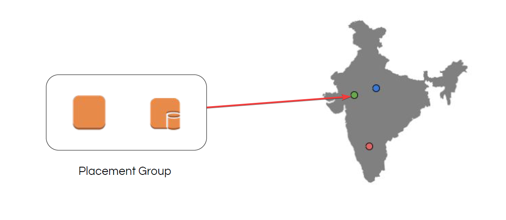
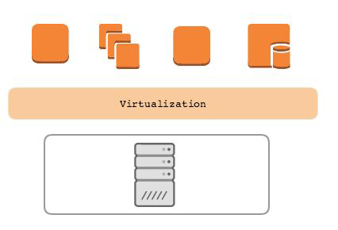
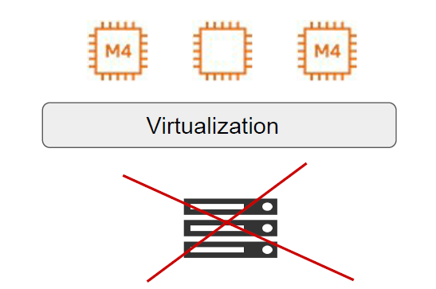
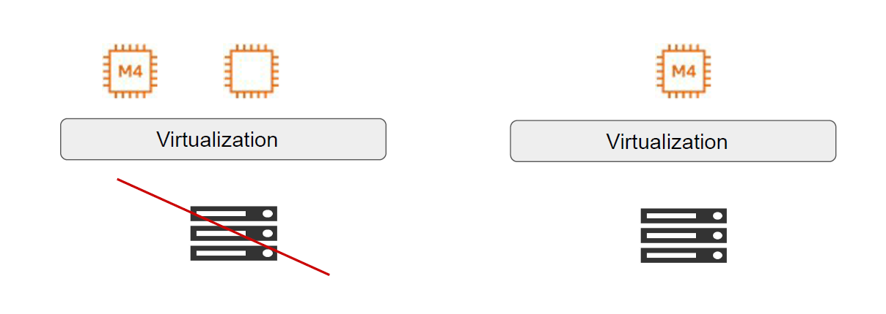
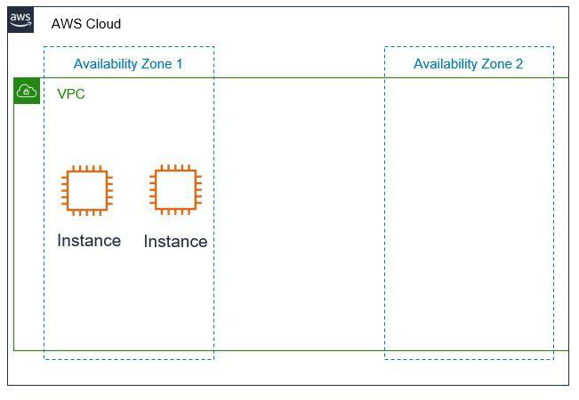
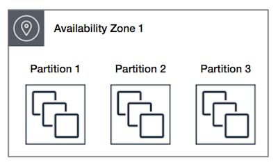
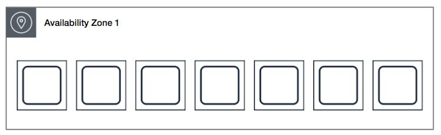

# Placement Groups

"Time to go fast"

## Placement Groups

- Placement group are recommended for applications that require low latency, high
network throughput.
- Placement groups can also be used to influence placement of a group of EC2
instances.

## Small Road vs Highway

## Let’s understand GUI way

## Point 2 - Influencing Placement of EC2

- A single server can run multiple virtual machines.

- This can lead to issues if you are running a cluster of servers.

Example:

- Medium Corp is running a MySQL cluster consisting of two servers in single AZ. In
the background, both the EC2 are part of the same underlying host.

## Example Use-Case

Medium Corp is running a MySQL cluster consisting of two servers in single AZ. The
server are of type m4.large.
In the background, both the EC2 are part of the same underlying host.

## Solution - Placement Group

With placement group, we can explicitly specify that two EC2 instance should not be part
of the same server (same rack of servers)

## Racks in Data Center

## ypes of Placement Groups

There are three types of placement groups available:

| Sr No | Type       | Description                                                                 |
|------:|------------|------------------------------------------------------------------------------|
| 1     | Cluster    | Packs instances close to each other in an Availability Zone.                |
| 2     | Partition  | Spreads instances in logical partition such that group of instances in one partition do not share underlying hardware. |
| 3     | Spread     | Strictly places group of instances across distinct hardware to reduce failures. |

## Cluster Placement Groups

Logical grouping of instances within a single Availability Zone.
Intended for applications that require low network latency and high network throughput.

## Partition Placement Groups

AWS ensures that each partition within a placement group has its own set of racks.
In the below diagram, there are 3 partition and each partition has multiple EC2 instances.
Each of these partition resides in a different rack inside the Data center.

## Spread Placement Group

A spread placement group is a group of instances that are each placed on distinct racks, with
each rack having its own network and power source.
In the following diagram, there are 7 EC2 instances and each instance is in a separate rack.

## Important Points - Cluster Placement Groups

- A cluster placement group can't span multiple Availability Zones.

- Only specific types of EC2 instances can be launched.

- Maximum network throughput traffic between two instance in placement group is
limited by the slower of the two instance.

- Recommended to launch all instance together. Launching instance later can lead to
capacity errors. In such-case, stop and start all instances in the placement group.
