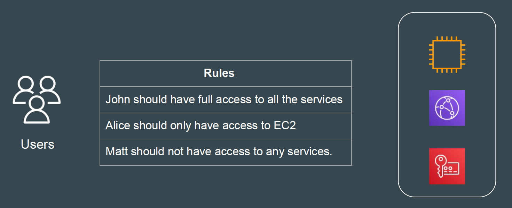
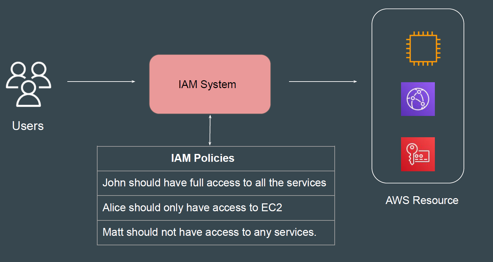
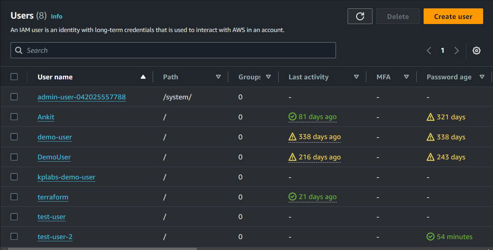
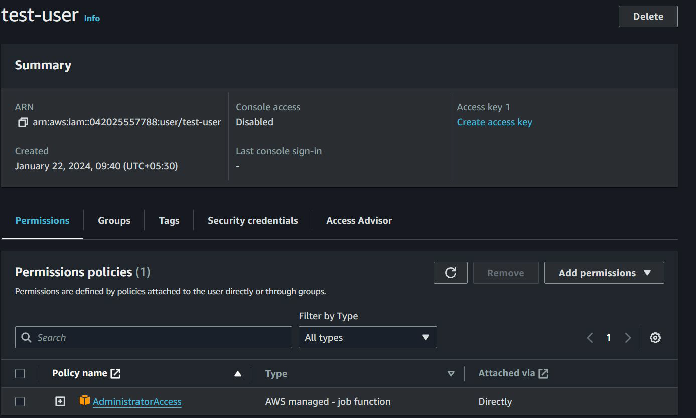
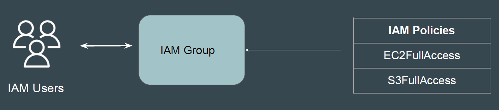
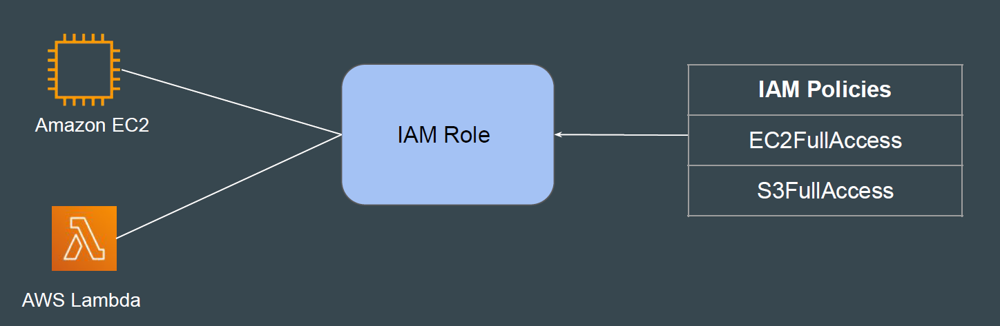

# Identity and Access Management

## Setting the Base

Identity and Access Management (IAM) service helps you control access to
AWS resources.

## Simplifying the Architecture

## IAM User

IAM user is an entity that you create in AWS to represent the person or
application that uses it to interact with AWS.

## Default Permissions of Users in AWS

Whenever a NEW user is created in AWS account, what operations will he be
able to perform?
Answer: None if he has no permission assigned.

## IAM Policies

IAM Policy defines permissions that a specific entity has in AWS.
You manage access in AWS by creating policies and attaching them to IAM
identities

## IAM Groups

An IAM group is a collection of IAM users.
IAM policy attached to the group is associated with all the users that are part of
the group.

## IAM Role

IAM Role is similar to IAM User.
Primary difference is that, it is primarily attached to AWS Resources.

