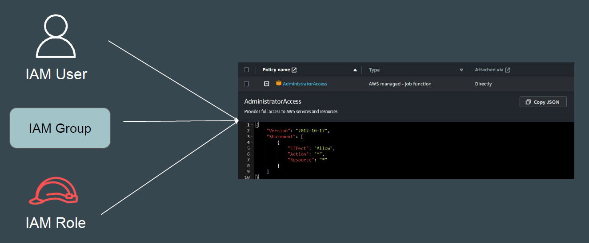
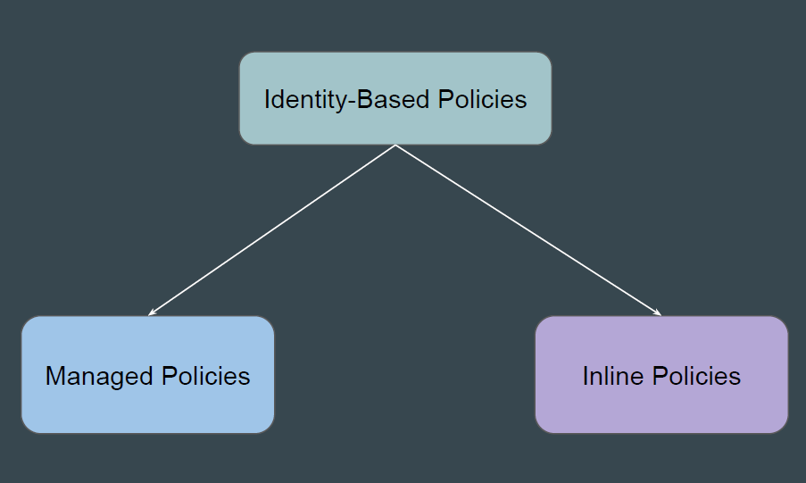
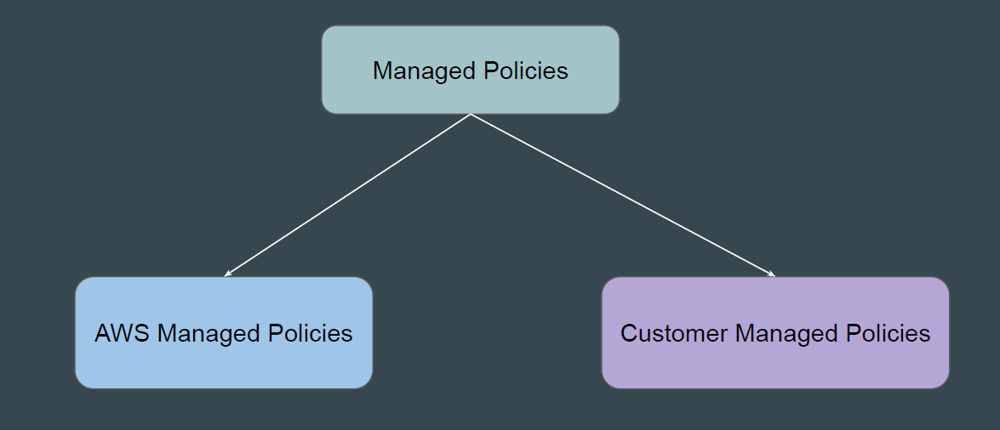
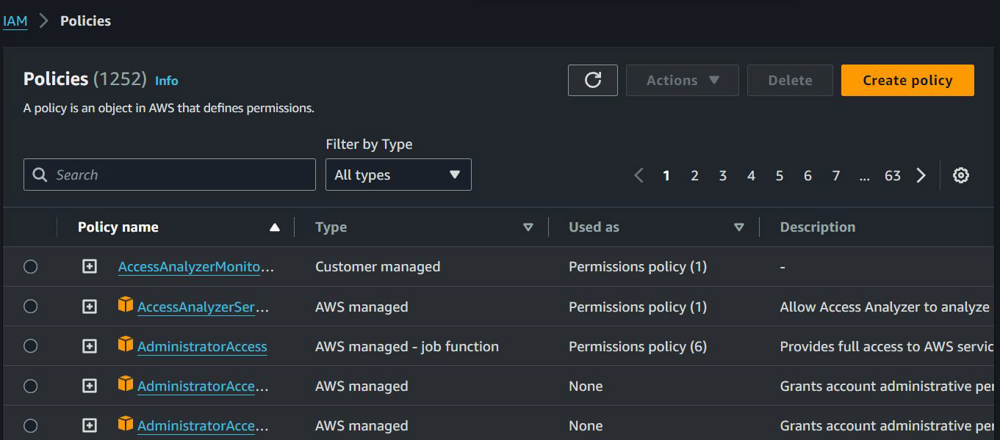
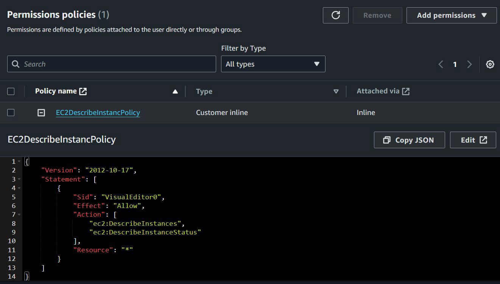
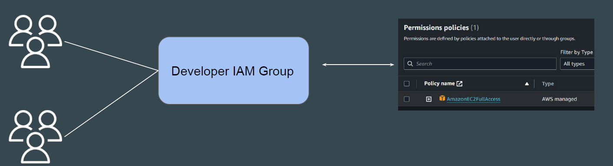

# Identity-Based IAM Policies

## Basics of Identity-Based IAM Policy

Identity-based policies are JSON permissions policy documents that are
attached to IAM User, Group and Roles to control their actions.

## Categorization of Identity-Policies

Identity-based policies can be further categorized as follows:

## Type 1 - Managed policies

Standalone identity-based policies that you can attach to multiple users, groups,
and roles in your AWS account.

## Managed Policies Categorization

| Managed Policies              | Description                                                                 |
|------------------------------|-----------------------------------------------------------------------------|
| AWS managed policies         | Managed policies that are created and managed by AWS.                       |
| Customer managed policies    | Managed policies that you create and manage in your AWS account.  
|                              | Customer managed policies provide more precise control over your policies than AWS managed policies. |

## Reference Screenshot - AWS Managed vs Customer Managed

## Type 2 - Inline Policies

Policies that you add directly to a single user, group, or role.

Inline policies maintain a strict one-to-one relationship between a policy and an
identity and are deleted when you delete the identity.

## Important Question - Which One to Use

Both Managed policies and Inline policies allows us to achieve same set of
use-case.

Which policy to use in which set of use-cases?

## Advantages - Managed Policies

| Advantages                  | Description                                                                 |
|-----------------------------|-----------------------------------------------------------------------------|
| Reusability                 | A single managed policy can be attached to multiple principal entities (users, groups, and roles). |
| Versioning and rolling back | When you change a customer managed policy, the changed policy doesn’t overwrite the existing policy. IAM creates a new version of the managed policy. IAM stores up to five versions of your customer managed policies. |

## Advantages - Inline Policies

In larger enterprises, there are always exceptions related to permissions.
Example: Out of 100 users in Developer group, you want to assign
SQSFullAccess permission to only 1 developer.

