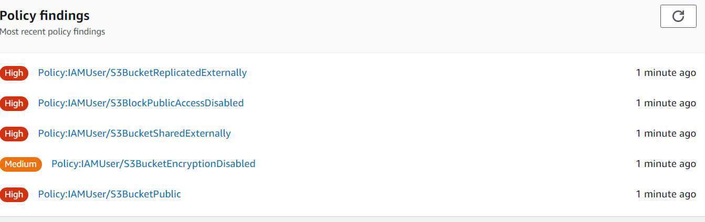

# Amazon Macie

"Machine Learning based Security"

## Core Feature of Macie

knowledge portal
S3 might contain sensitive information like PII data, database backups, SSL private keys and
various others.
Amazon Macie makes use of machine learning to identify sensitive data stored in AWS.

## Type of Data Detected

Macie can detect several categories of sensitive data.

Some of the types of data that Macie detect include:

| AWS secret access key | Birth date | Credit card expiration date |
|----------------------|------------|-----------------------------|
| Bank account number (US and Canada) | Credit card magnetic stripe data | Credit card number |
| Credit card verification code | Driver’s license identification number | Full name |
| Global Positioning System (GPS) coordinates | Google Cloud API key | HTTP cookie |
| Mailing address | OpenSSH private key | Phone number |

## Point to Note

Macie provides you with an inventory of your S3 general purpose buckets, and
automatically evaluates and monitors the buckets for security and access control.

If Macie detects a potential issue with the security or privacy of your data, such
as a bucket that becomes publicly accessible, Macie generates a finding for you
to review and remediate as necessary.

## Custom Data Identifiers

In addition to using the managed data identifiers that Amazon Macie provides,
you can build and use custom data identifiers.

A custom data identifier is a set of criteria that you define to detect sensitive data
in Amazon S3 objects.
The criteria primary includes regular expressions

