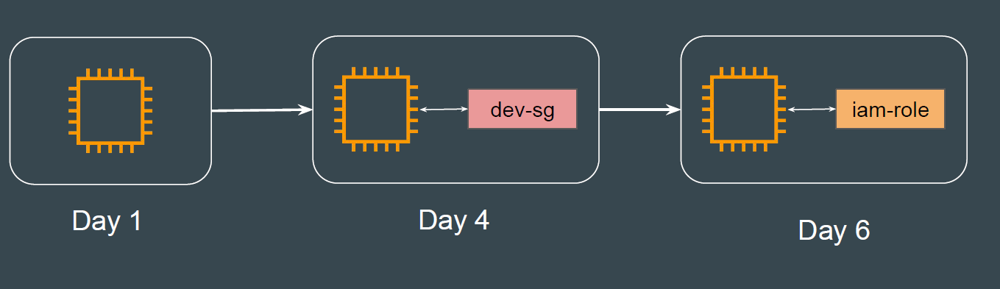
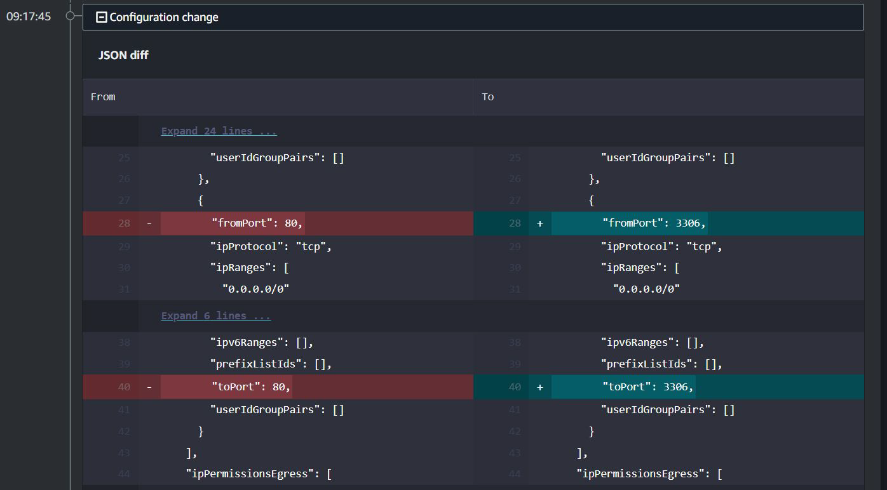
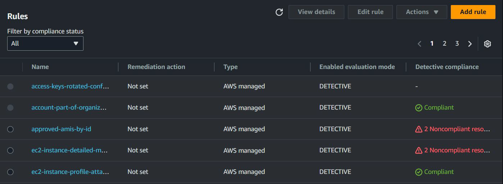
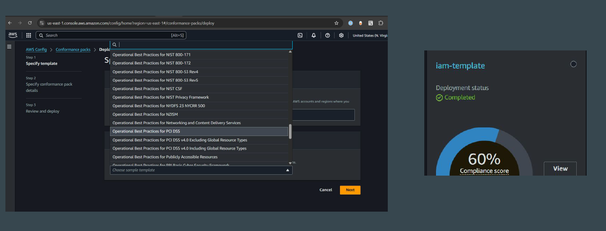
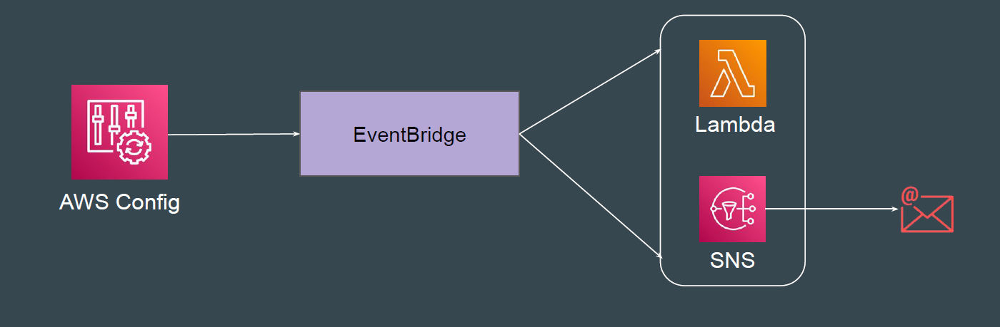

# AWS config

## Feature 1 - Recording Configuration Changes

AWS Config continuously monitors and records changes to resource
configurations and allows you to see timeline of changes.

## Reference Screenshot - Configuration Changes Shown

## Feature 2 - Audit and Compliance

AWS Config helps organizations automatically detect policy violations by
analyzing the resource changes.

## Feature 3 - Conformance Packs

A conformance pack is a collection of AWS Config rules and remediation actions
that is built using a common framework.

## Integration with EventBridge

Amazon EventBridge can capture AWS Config rule evaluation events and route
them to various AWS services or custom targets for automated responses.

Example: Send an Email when specific compliance to a rule fails.

## AWS Config and AWS CloudTrail

AWS CloudTrail records API activity and events in your AWS account, including
who made the call (user/role), what action was taken (e.g., CreateInstance),
when it happened, and details like IP address or response status.

AWS Config records point-in-time configuration details for your AWS resources.

You can use a Config to answer, “What did my AWS resource look like?” at a
point in time. You can use CloudTrail to answer “Who made an API call to modify
this resource?”

## Pricing of AWS Config

With AWS Config, you are charged based on the number of configuration items
recorded, the number of active AWS Config rule evaluations, and the number of
conformance pack evaluations in your account

You pay $0.003 per configuration item recorded in your AWS account per AWS Region. A
configuration item is recorded whenever a resource undergoes a configuration change or a
relationship change.

Based on rule evaluation. A rule evaluation is recorded every time a resource is evaluated
for compliance against an AWS Config rule.

You are charged per conformance pack evaluation in your AWS account per AWS Region
based on the tier below.
