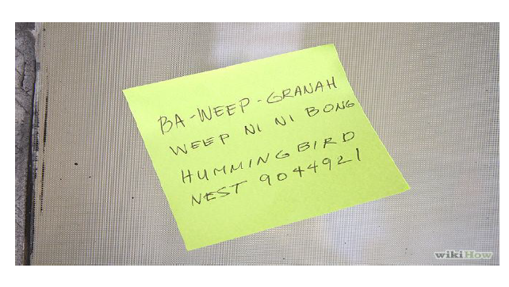
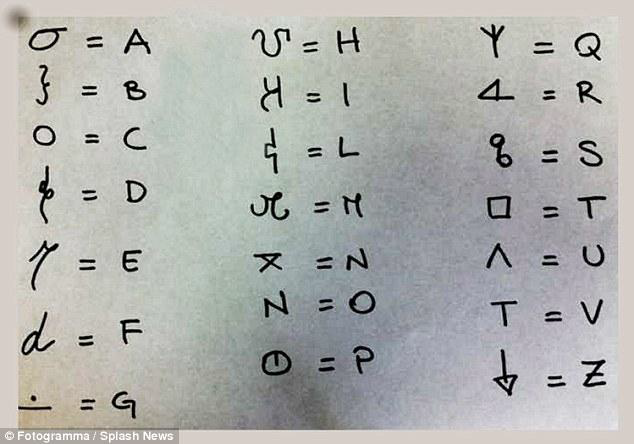
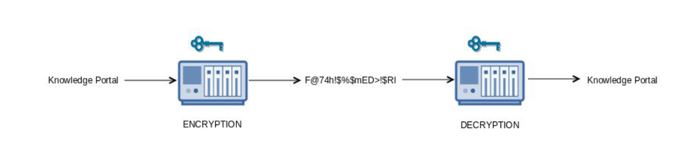
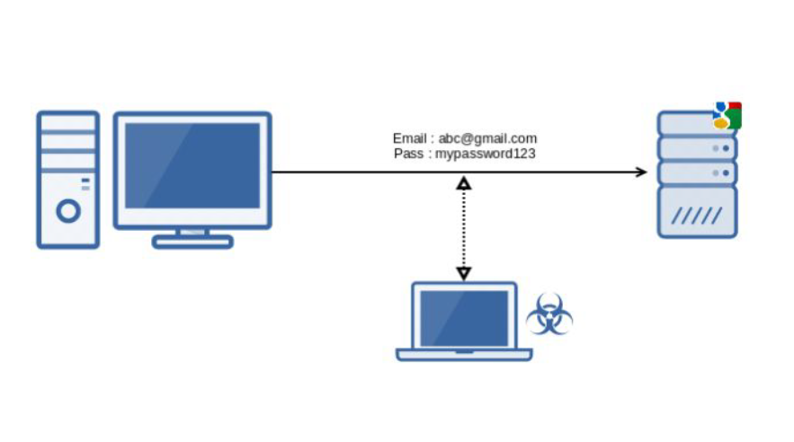
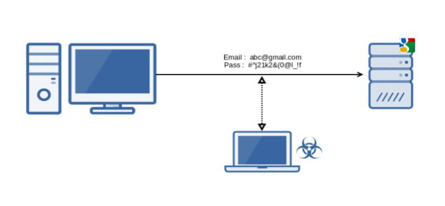
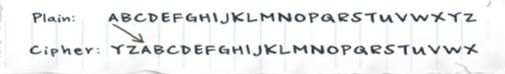
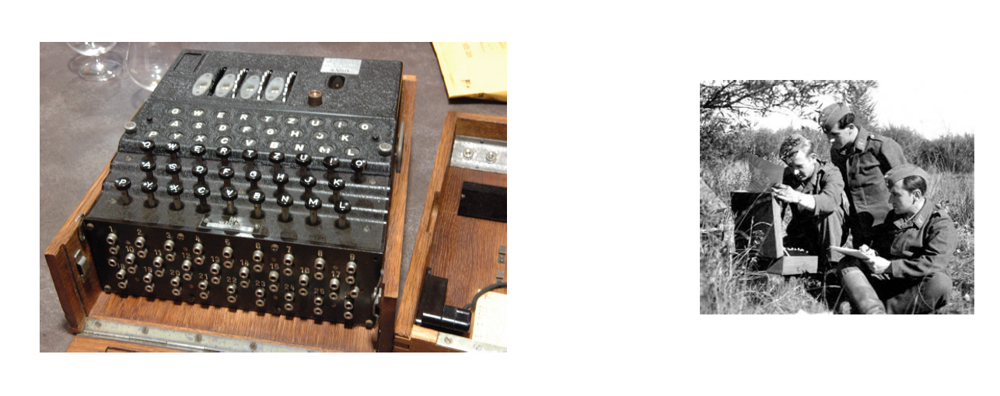
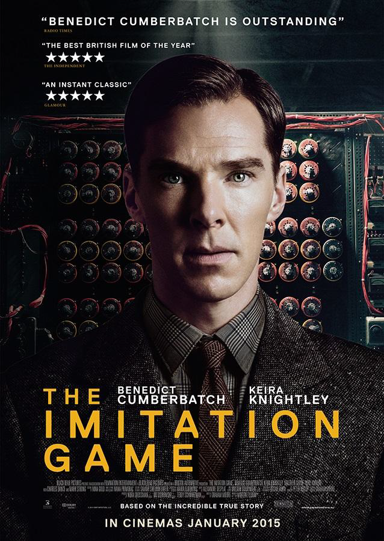

# Cryptography

"Time to Secret Out"

## Secret Code Word among Friends

## Designing simple encryption

## Symmetric Key Encryption

## Why Encryption ?

## After Encryption

## Designing simple encryption

- Normal Password :- MYPASSWORD

- Encrypted PWD :- KWNYQQUMPB

During War times, secret data were always sent in encrypted format.

## Algorithms are quite complex

## Encryption used during wars - Famous Enigma

## Good Movie to watch

It is a story about a British mathematician Alan trying to build amachine that would break the
german encryption codes.

