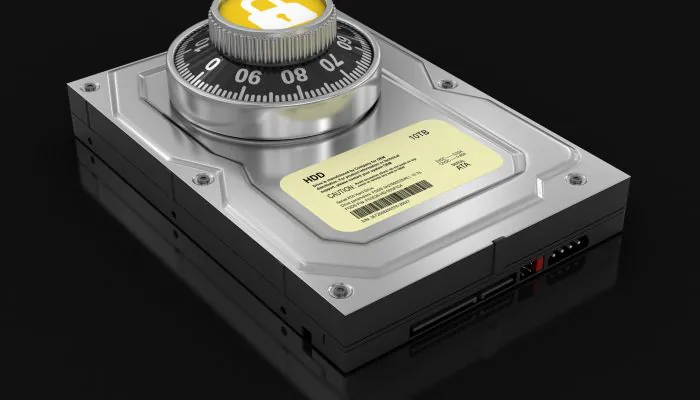

## Understanding the Disk Level encryption schemas

Disk-level encryption (or Full Disk Encryption - FDE) protects data by automatically converting all information on a hard drive or SSD into unreadable code using software or hardware.

It prevents unauthorized access, especially in case of device theft, by requiring a key or password at boot-up. It covers the OS, system files, and user data

## Common Solutions

- **Windows:** BitLocker is commonly used, which can secure all data, including the OS.

- **macOS:** FileVault provides native FDE.

- **Hardware:** Self-encrypting drives (SEDs) use hardware-level encryption with no performance impact.

