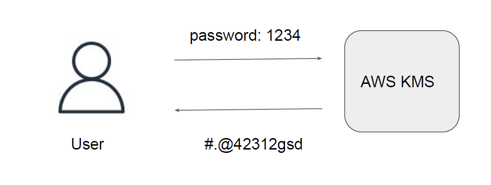
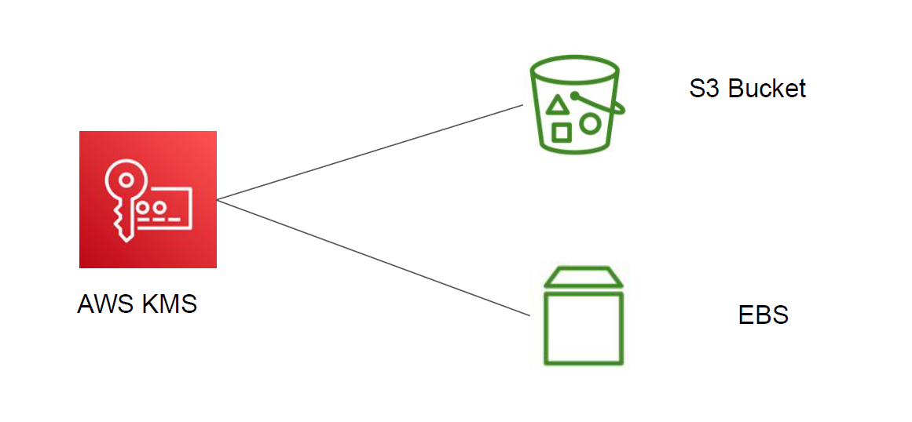
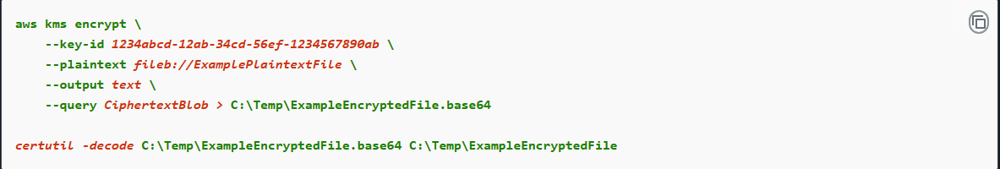

## Basics of KMS

AWS KMS stands for AWS Key Management Service.

This service provides capability to encrypt and decrypt the data.

## Integration of KMS

AWS KMS also integrates with various AWS services like S3, DynamoDB, EBS and others.

### Example Using the AWS CLI to encrypt data on Windows

