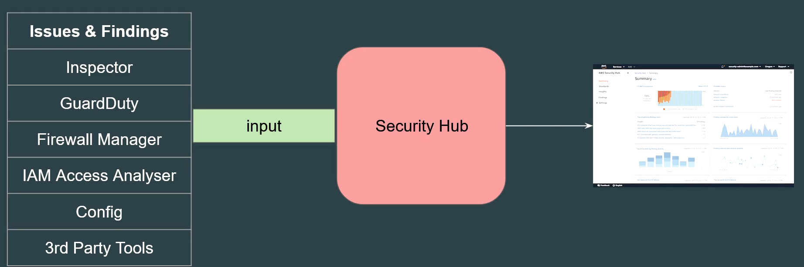
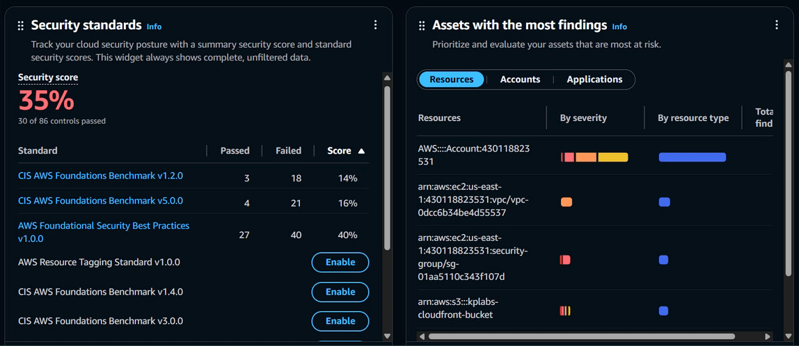

# AWS Securtiy Hub

## Setting the Base

AWS Security Hub collects security data from AWS accounts and services, and helps you analyze, identify and prioritize and security issues across your AWS environment.

## Security HUB CSPM

Security Hub CSPM (Cloud Security Posture Management) is a capability of Security Hub offering automated security best practice checks to help you understand your overall security posture across
your AWS accounts.

Security HUB CSPM supports multiple security standards like CIS, PCI DSS, NIST

