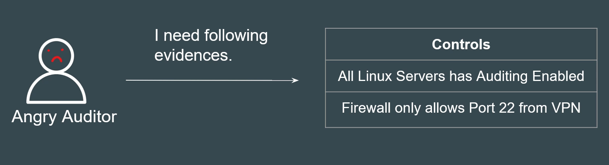
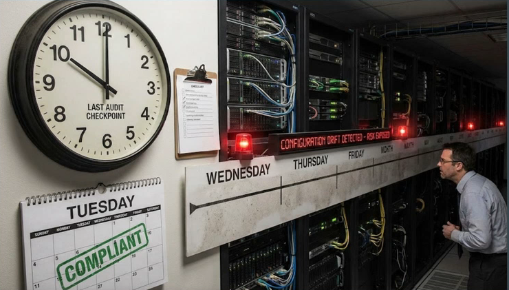
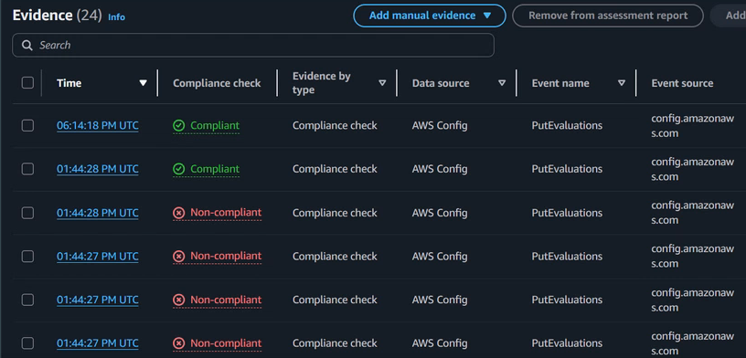

# AWS Aduit Manager

## Challenges of Audit

Preparing for an sudit is widly considered a time-consuming and manual process.

Engineers had to mannually take screnshots of configurations and environment to prove that is complies against a specific control.

## Challanges of Audit - Point in Time Checks

Audits are typically based on a "Point-in-time" check.

You might be compliant on the day of the audit (Tuseday), but if a configuration drifted on Wedensday, you wouldn't know until the next audit cycle (a year later).

This left long windwos of unobseerved risk.

## Introducing AWS Audit Manager

AWS Audit Manager is a fully-managed service that provides prebuild frameworks for common industry standards, and that automates the continual collection of

evidence to help you prepare for an audit.

Intead of humans taking screenshots, Audit Manager contiuously monitors your environment. it automatically snaps "evidence" every time a resource configuration is compliant (or non-compliant)

