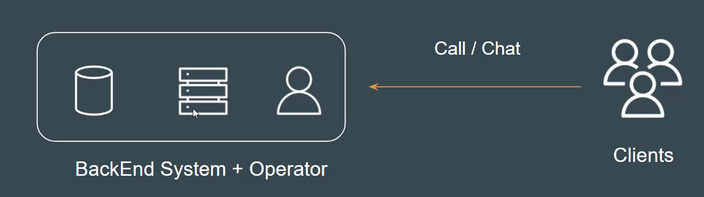
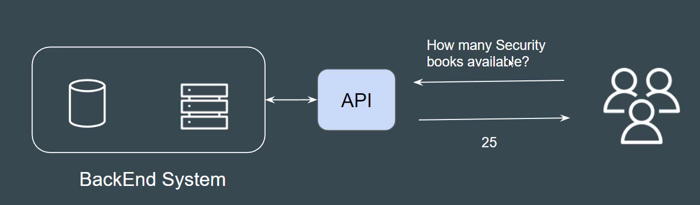
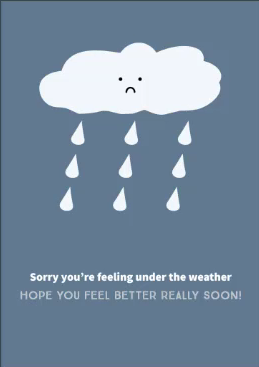

## understanding the challenge

- Bookkeeper distributer maintains the list of available of books in it's backend systems.

- Operator has access to backend system to check the availability.

- clients they conect to operator via phone call /chat option.

## API Based approach

The book distributer clould provide an API to check stock availability.

APIs let you open up access to your resources while maintaining security and control.

## Simple Use-Case

- James wants to build a waether report application.

- OpenWeatherMap is an online service that provides global wather data via API.

- He decided to connect his application to OpenWeatherMap API to fetch the latest reports and populate it in application.

