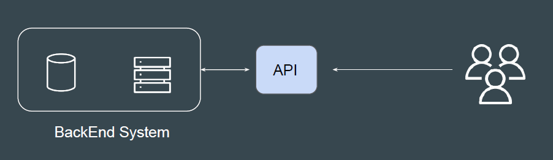
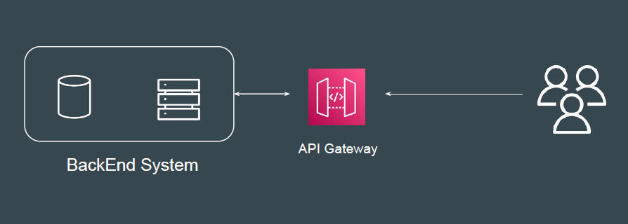

# API Gateway

APIs act as the "front door" for applications to access data, business logic, or
functionality from your backend services.

Hence API should be able to be highly available and handle thousands of
requests.

Amazon API Gateway is a fully managed service that makes it easy for
developers to create, publish, maintain, monitor, and secure APIs at any scale.

# API Gateway Practical

1- Create HTTP API

2- API will invoke a backend Lambda function.

