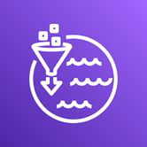
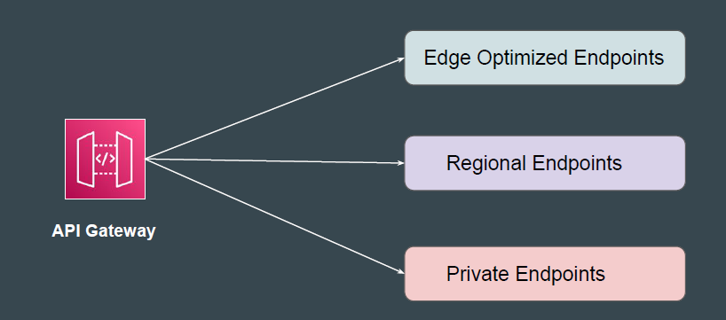
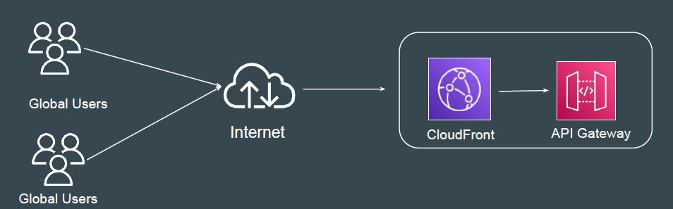
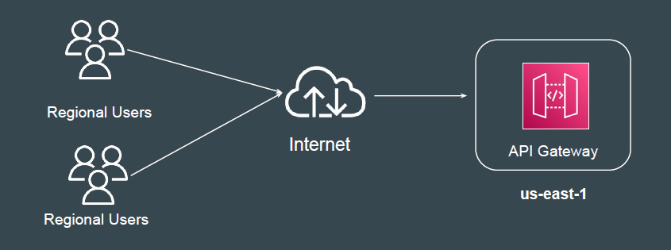

# API Gateway Endpoint

## API Endpoints

Depending on where the majority of your API traffic originates from, you can
create a appropriate API Gateway endpoint type.

## Edge-optimized API endpoints

An edge-optimized API endpoint is best for geographically distributed clients.

API requests are routed to the nearest CloudFront Point of Presence (POP).

This is the default endpoint type for API Gateway REST APIs.

## Regional API endpoints

A regional API endpoint is intended for clients in the same region.

When a client running on an EC2 instance calls an API in the same region, or
when an API is intended to serve a small number of clients with high demands,
a regional API reduces connection overhead.

## Private API endpoints

A private API endpoint is an API endpoint that can only be accessed from your
Amazon Virtual Private Cloud (VPC) using an interface VPC endpoint.

