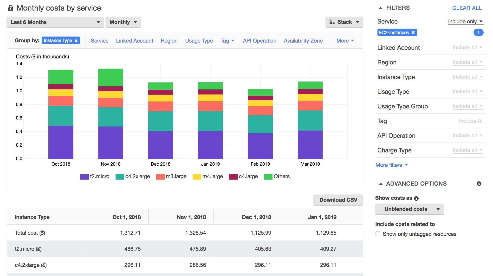
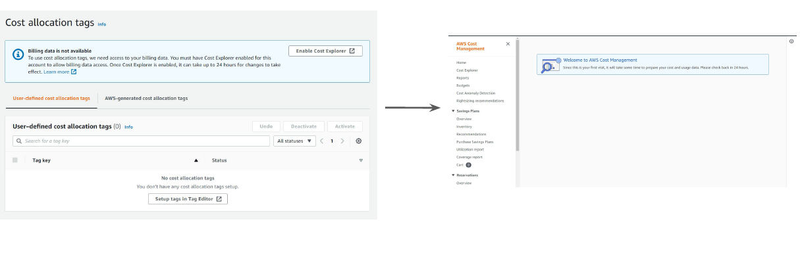

# AWS cost Explorer

"AWS Cost Optimization"

## Overview of AWS Cost Explorer

AWS Cost Explorer has an easy-to-use interface that lets you visualize, understand, and
manage your AWS costs and usage over time.

## Enabling Cost Explorer

AWS Cost Explorer is not enabled by default and you will have to explicitly enable it from
the Billing console

