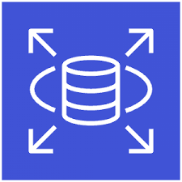
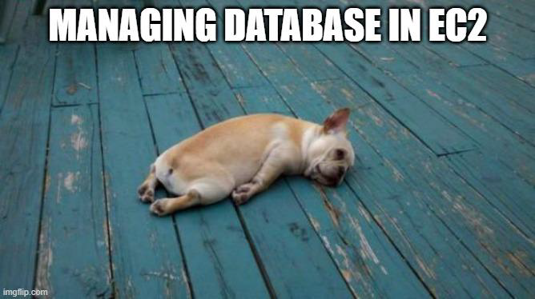
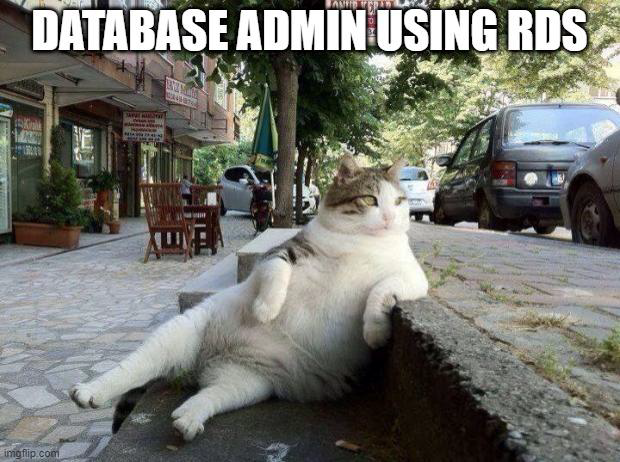

# Introduction to RDS

"Managed Database Service"

## Challenges with EC2 DB

Maintaining database in EC2 instance leads to multiple challenges, this includes:

1. Provisioning Database.

2. Host Security (Patching, Hardening and others)

3. Configure Replicas, High-Availability, Upgrading and others

Most organizations simply offload these tasks to 3rd party vendors or hire database administrators.

## Intro to RDS

Amazon RDS is a managed service that makes it easy to set up, operate, and scale a relational
database in the cloud.

AWS manages the underlying hardware, OS, security and software patching, automated failure
detection and recovery for you.

In click of few buttons we can :

- Provision / Resize hardware on-demand.

- Multi-AZ deployments.

- Create read replicas.

