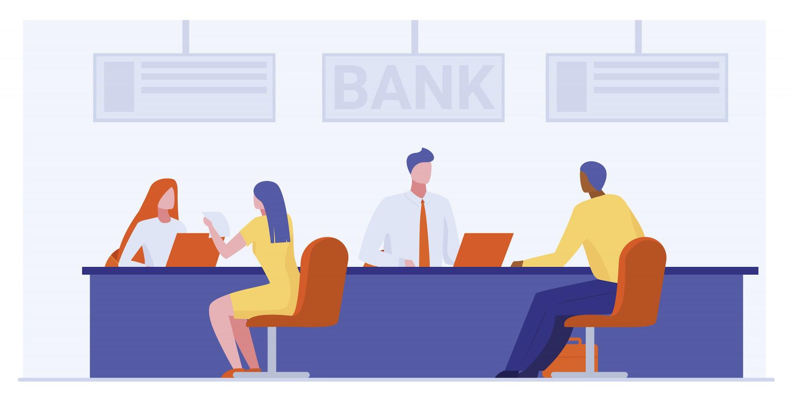
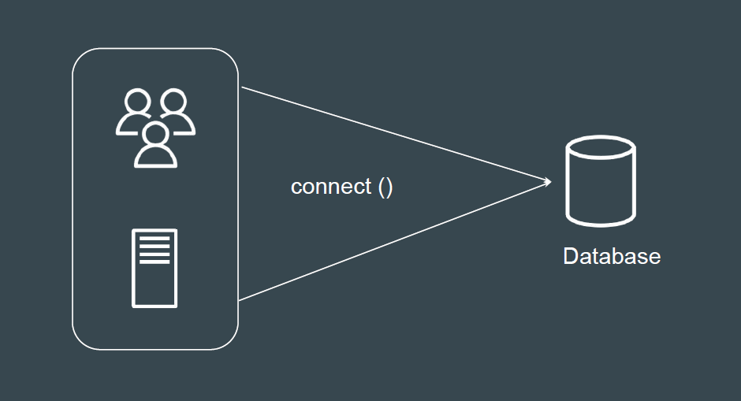
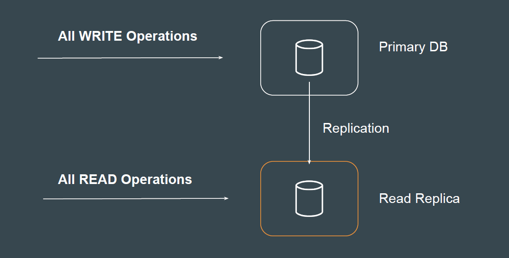
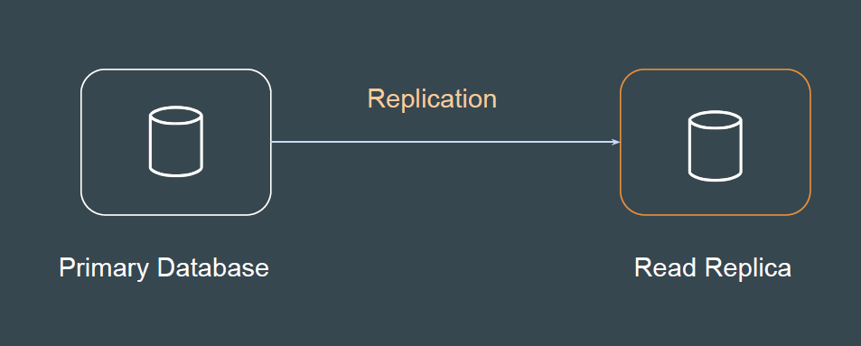
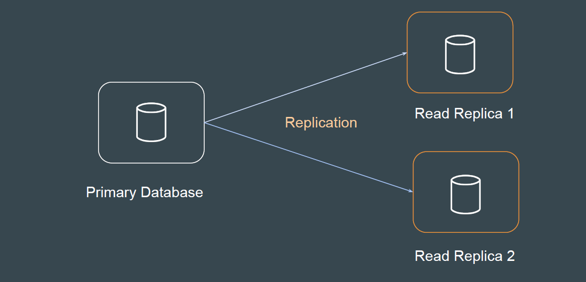
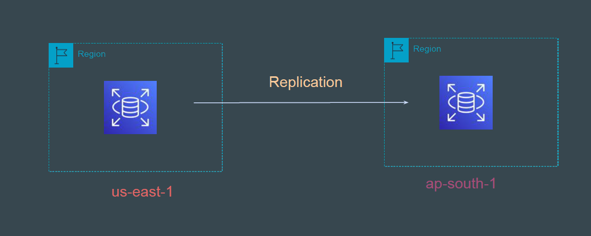

# RDS Read Replicas

## Use Case : Bank

In bank, for different kind of work purpose, there are different people you might
have to approach. For example :

- Cash Collector
- Cheque Counter
- Enquiry Counter

## Database Way

Using a single database for all kind of activity will increase the database load
and slow down the operations.

## Improved Architecture - Read Replica

Read Replica allows customers to offload read requests or analytics traffic from
the primary instance

## RDS Read Replica

RDS Read Replica feature allows customers to implement “Database Read
Replica” functionality for RDS databases.

## Pointers to Note - 1

You can create one or more replicas of a given source DB Instance and serve
high-volume application read traffic.

## Pointers to Note - 2

With Amazon RDS, you can create a read replica in a different AWS Region
from the source DB instance.

