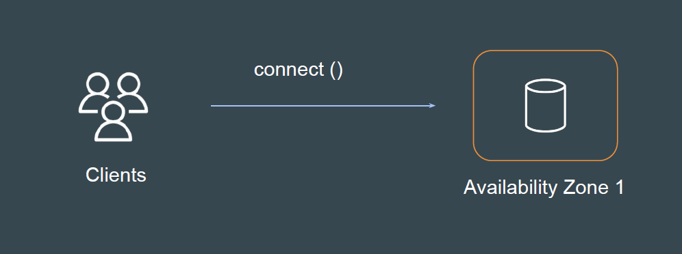
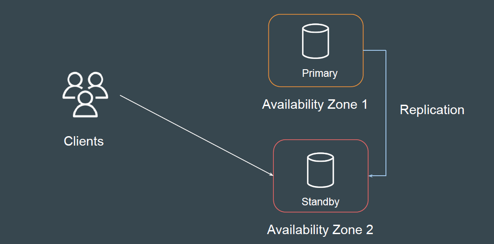

# Amazon RDS Multi AZ Deployments

## Understanding the Challenge

If database is running in a specific availability zone and if the AZ is down or
unreachable then your entire application can be impacted.

## Multi-AZ Architecture

In this approach, Amazon creates a standby DB instance and synchronously
replicates data from the primary DB instance in a different availability zone.

## Failover Condition

If a planned or unplanned outage of your DB instance results from an
infrastructure defect, Amazon RDS automatically switches to a standby replica
in another Availability Zone if you have turned on Multi-AZ.

- Loss of availability in primary Availability Zone
- Loss of network connectivity to primary
- Compute unit failure on primary
- Storage failure on primary

Failover times are typically 60–120 seconds.
