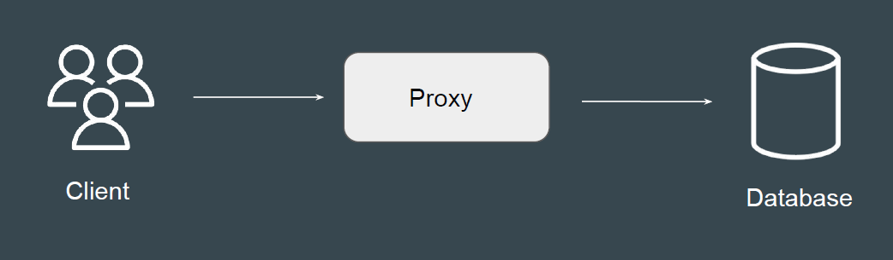
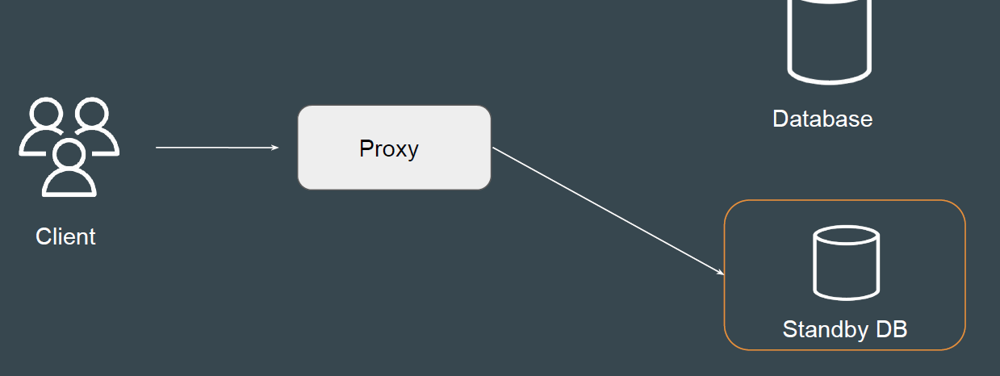
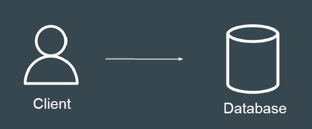
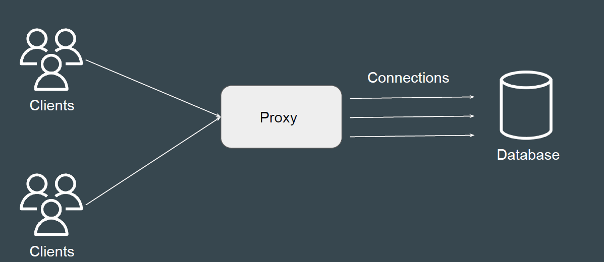

# RDS Proxy

## Basics of Database Proxy

Database Proxy is a intermediary between a user and database
Since the queries goes through Proxy and then to database, there are lot of
controls and optimizations that can be applied.

## Use-Case - FailOver Scenarios

Proxies can be used in the scenario of master failover
Requests are maintained during the time.

## Basics of Database Connections

Following are high-level steps that take place when app connects to database.

1. Application makes use of Database driver to open connection to DB.

2. Network Socket is opened in OS to connect application to DB.

3. Authentication takes place.

4. Operation Complete and Connection can be closed.

5. Network Socket is closed.

## Connection Pooling

Database connection pooling is a way to reduce the cost of opening and
closing connections by maintaining a “pool” of open connections.

## RDS Proxy

AWS RDS proxy is a fully-managed database proxy for Amazon RDS.

| Benefits            | Description                                                                 |
|--------------------|-----------------------------------------------------------------------------|
| Connection Pooling | Improves application performance by reducing the number of open database connections |
| Availability       | Makes applications more resilient to database failures by automatically connecting to a standby DB instance while preserving application connections |
| Authentication     | Can also enforce AWS Identity and Access Management (IAM) authentication for databases |
