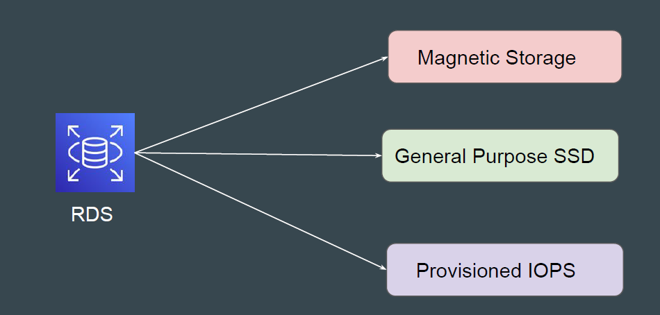
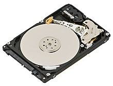
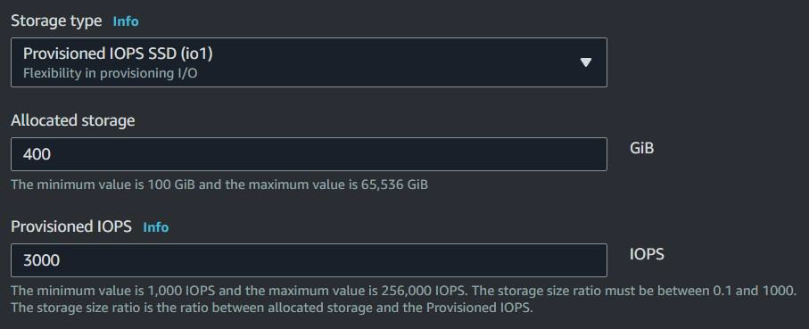

# RDS DB instance storage

## Understanding the Basics

RDS offers multiple options in terms of storage suitable for different set of
applications.

## Magnetic Storage

Amazon RDS also supports magnetic storage for backward compatibility.
Some of the limitations of Magnetic Storage include:

- Doesn't support storage autoscaling.

- Limited to a maximum size of 3 TiB.

- Limited to a maximum of 1,000 IOPS.

AWS does not recommend this storage option unless required.

## General Purpose SSD

General Purpose SSD storage offers cost-effective storage that is acceptable
for most database workloads that aren't latency sensitive

General Purpose storage is best suited for development and testing
environments.

## Provisioned IOPS SSD

For a production application that requires fast and consistent I/O performance,
AWS recommends Provisioned IOPS storage.

Provisioned IOPS storage is best suited for production environments.

## Comparison Table

| Characteristic   | Provisioned IOPS (io1)                                             | General Purpose (gp3)                                      | General Purpose (gp2)                                  |
|-----------------|--------------------------------------------------------------------|-------------------------------------------------------------|--------------------------------------------------------|
| Maximum throughput | Scales based on Provisioned IOPS up to 4,000 MB/s                | Provision additional throughput up to 4,000 MB/s            | 1000 MB/s (250 MB/s on RDS for SQL Server)             |
| Maximum IOPS       | 256,000 (64,000 on RDS for SQL Server)                          | 64,000 (16,000 on RDS for SQL Server)                      | 16,000                                                |
| Volume size        | 100 GiB–64 TiB                                                  | 20 GiB–64 TiB                                               | 20 GiB–64 TiB                                         |
