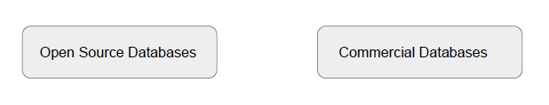
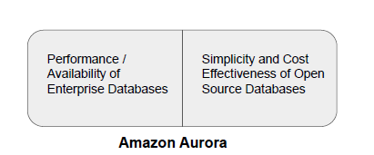
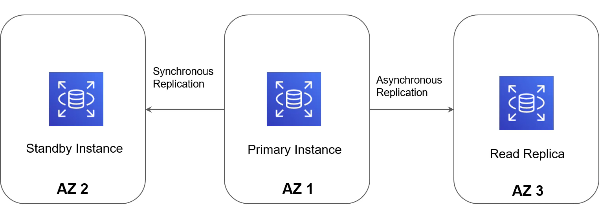
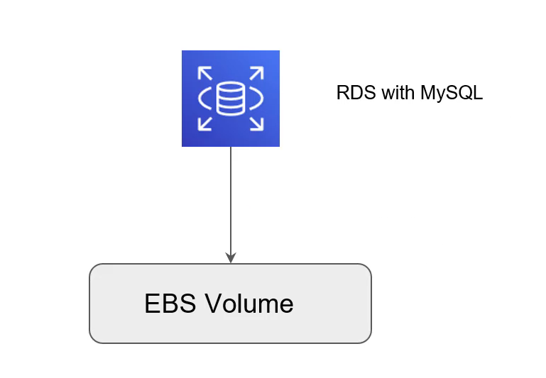
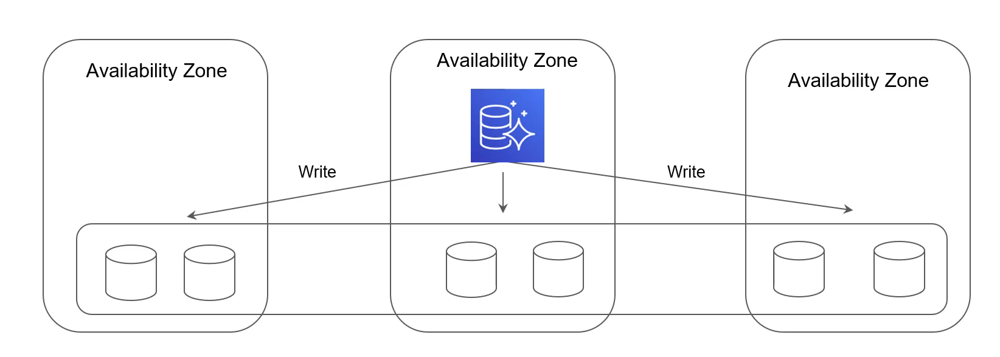
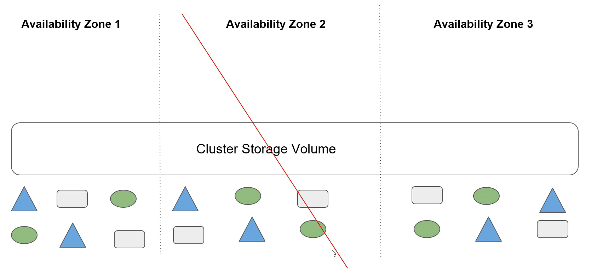
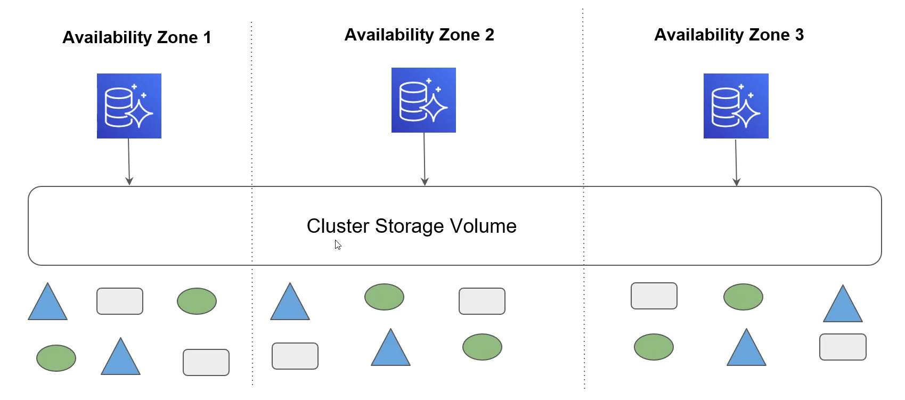
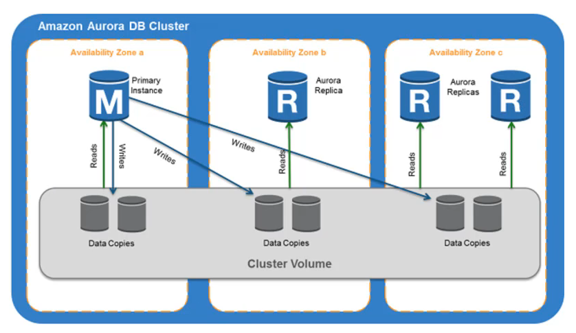
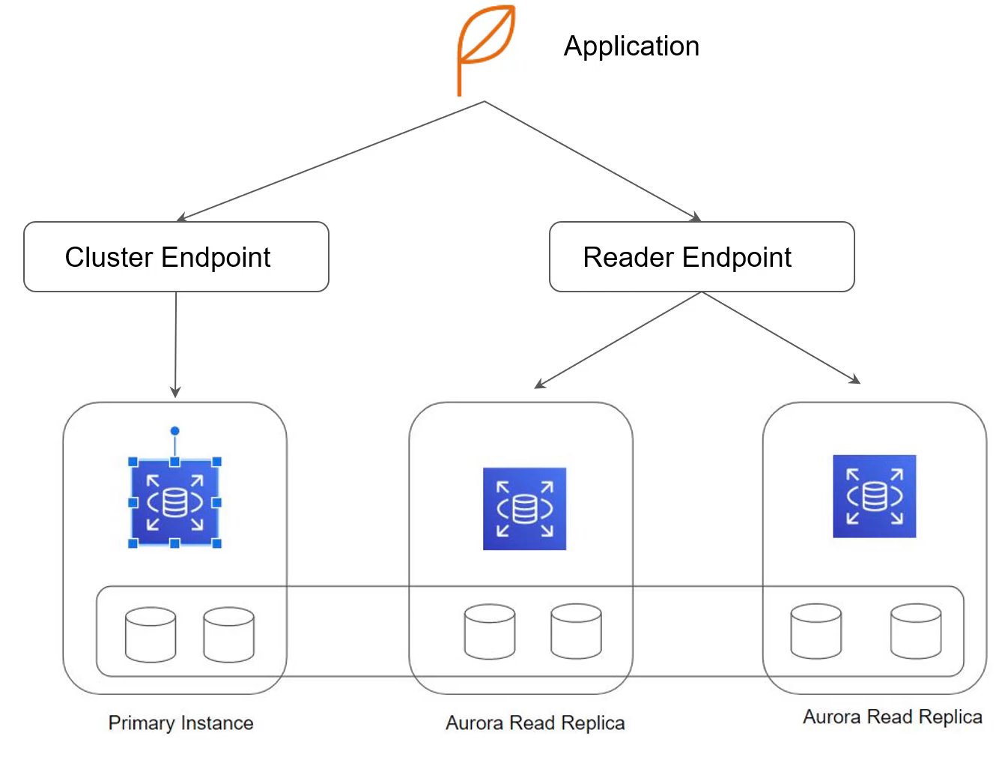

# Amazon Aurora

"Closed Source Database"

## Overview of Database Offerings

Databases are generally divided into two types:

- Open Source Databases

- Commercial Databases

Commercial Offering does come with various aspects that are not found in the open
source databases.

## Introducing Aurora

Amazon Aurora is a MySQL and PostgreSQL-compatible relational database built for the cloud, that combines the performance and availability of traditional enterprise databases with the simplicity and cost-effectiveness of open source databases.

Amazon Aurora is up to five times faster than standard MySQL databases and three times faster than standard PostgreSQL databases.

It provides the security, availability, and reliability of commercial databases at 1/10th the
cost

## RDS - Multi-AZ & Read Replica Architecture

In a typical setup, primary, standby and read replicas are three diffrent intance in multiple avilability zones.

The underlying storgae is EBS volume.

## RDS with EBS Storage

## Aurora Architecture

Two Primary components: DB Instances + Storage Cluster Volume

Since Aurora and Storage layer are independent, we can scale storage eascily.

With this architecture, you can add a DB instance quickly becouse Aurora doesn't make a new copy of the table data, Instead , DB instance connects to the shared volume that already contains all your data.

## Overview of Storage Volume

## Scale at a fastter pace

## Aurora Architecture

## Aurora Endpoints

You can connect to an Aurora cluster through endpoints.

Endpoints are Aurora-specific URIs consisting of a host and port.

There are three primary types of endpoints available:

- Cluster Level Endpoints
- Reader Level Endpoints
- Instance Level Endpoints

## Aurora Endpoints

| Endpoint Types            | Description                                                                 |
|--------------------------|-----------------------------------------------------------------------------|
| Cluster Level Endpoints  | Connects to the current primary DB instance in the cluster. Used for performing write operations. |
| Reader Level Endpoints   | Built-in endpoints for read replicas. For multiple read replicas, this endpoint balances load among all read replicas. |
| Instance Endpoints       | Allows connection directly to the specific instance.                        |
| Custom Endpoints         | Ability to create custom endpoints for specific application requirements.  |

## Aurora Features

Aurora provides a wide variety of interesting features. Some of these include:

| Feature                     | Feature                     |
|-----------------------------|-----------------------------|
| Global Databases            | Serverless                  |
| Cross Region Replication    | Auto-Scaling                |
| Backtrack                   | IAM DB Authentication       |
| Sharing DB Clusters         | RDS Proxy                   |
