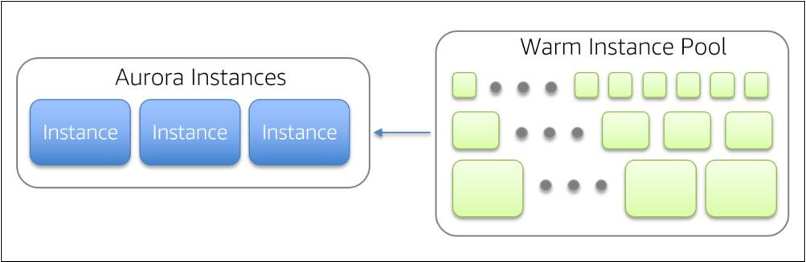

# Aurora Serverless

"Auto-Scaling Database"

## Understanding the Typical Setup

In a typical DB setup, one of the primary configuration during database setup is DB
instance size.

Example: t2.small
If your workload changes, you can modify the DB instance class size

## Challenge with the Approach

In some environments, workloads can be intermittent and unpredictable.

There can be periods of heavy workloads that might last only a few minutes or hours,
and also long periods of light activity, or even no activity.

In these cases, it can be difficult to configure the correct capacity at the right times. It
can also result in higher costs when you pay for capacity that isn't used.

## Choices for Customers

Provision for peak --> Expensive

Provision less than peak --> End-user (business) impact  

Continually monitor and adjust capacity manually --> Requires experts & risks outages

## Aurora Serverless

Aurora Serverless automatically scales up and down based on the capacity your
workload consumes.

When DB is idle, it will automatically be shut down, and when workload resumes, it will
automatically spin it back up.

You set the minimum and maximum capacity.

flowchart LR
    A["2 GB RAM"] <--> B["488 GB RAM"]

## Pooled Aurora Resources

Warm Instance Pool represents a warm fleet of instances that can be easily swapped in to
add capacity to your environment.

These instances are allocated in a range of sizes, providing Aurora Serverless with a more
granular approach to how it responds to variations in load.

