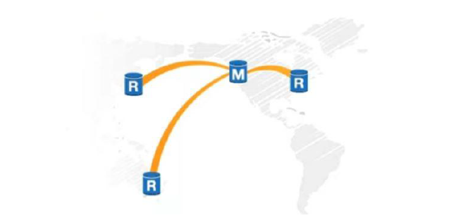
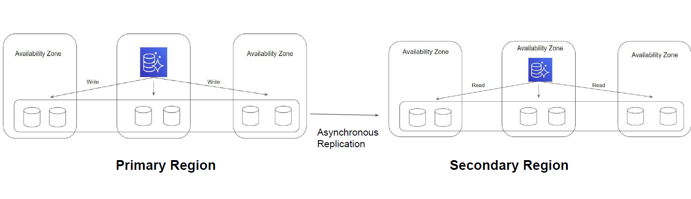

# Aurora Global Database

"Scalability Aspect"

## Overview of Global Database

Aurora Global Database allows a single Amazon Aurora database to span multiple AWS
regions.

It replicates your data with no impact on database performance, enables fast local reads
with low latency in each region, and provides disaster recovery from region-wide
outages.

## Replication Approach

Data is replicated based on asynchronous replication between the storage layer of the
two regions.

## Important Pointers

Global Database does not support automated failover to the secondary region. This step
is manual.

Not all instance types are supported. You can't use db.t2 or db.t3 instance classes.
Certain features like Backtrack are not supported.

Stopping and starting the DB clusters within the global database is not supported.
