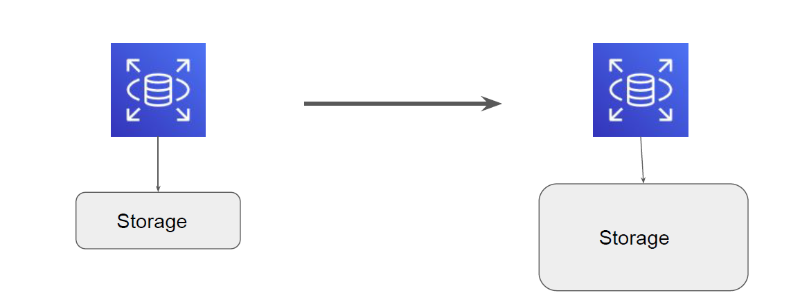

# RDS Storage Auto-Scaling

"Auto-Scaling Storage"

## Overview of Storage Auto Scaling

RDS Storage Auto Scaling automatically scales storage capacity in response to growing
database workloads, with zero downtime

## Important Pointers to Remember

Amazon RDS starts a storage modification for an auto scaling-enabled DB instance
when these factors apply:

1. Free available space is less than 10 percent of the allocated storage.

2. The low-storage condition lasts at least five minutes.

3. At least six hours have passed since the last storage modification.

## Important Pointers to Remember - 2

Autoscaling can't completely prevent storage-full situations for large data loads, because
further storage modifications can't be made until six hours after storage optimization
has completed on the instance.

The additional storage is in increments of whichever of the following is greater:

- 5 GiB
- 10 percent of currently allocated storage

Autoscaling can't be used with the following previous-generation instance classes that
have less than 6 TiB of orderable storage: db.m3.large, db.m3.xlarge, and db.m3.2xlarge.
