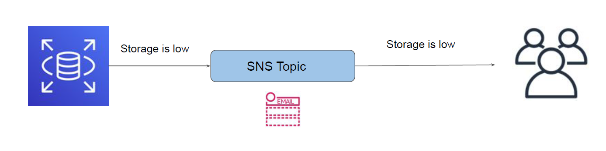

# RDS Event Notification

"Back to Notifications!"

## RDS Event Notification

RDS Event Notification provides notification when a specific type of RDS event occurs.

These events are categorized into multiple categories like Availability, Configuration Change,
Failure, Deletion, Low Storage and others.

