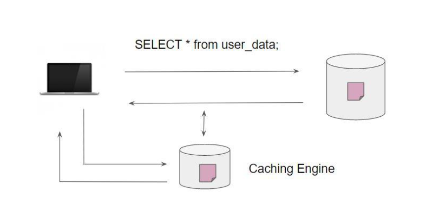
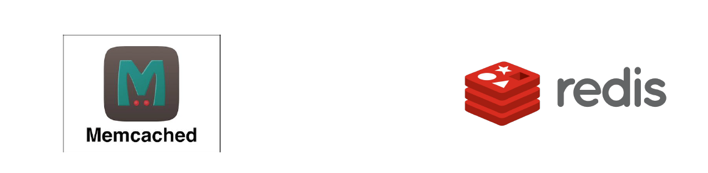

# AWS ElastiCache

"Let’s Cache"

## Simple Analogy

● There is a new vegetable shop in the locality which has become very popular.

● Every day 300-500 people visit and buy vegetables.

● Each visitor asks the price of at-least two-three veggies before making a purchase.

Imaging the condition of the employee inside that shop after a few days.

## Simple Analogy - Smart Approach

Vegetable Shop Owner decided to create a dashboard that has a list of all the common vegetable
prices which are requested by the buyers.

## Simple Analogy - Learning

1. Since the price list of common items was listed, users no longer need to ask the employees
about it. This reduces the overall load on the employee.

2. Visitors can quickly get to go through the price list - Better Efficiency.

## Challenges with Database Workloads

There can be certain common queries within the database that hundreds of users might
request.

This would increase the load on the database and can lead to performance degradation.

## Caching Solutions

With caching solutions, you can cache the response associated with frequent queries.

This allows better response time and decreases the load on the database servers.

## Popular Caching Solutions

Two of the most popular caching solutions used for databases are:

1. Memcached

2. Redis

To use them, you will have to install, configure, optimize and secure the EC2 instances where
these engines would be running.

## Introducing AWS ElastiCache

ElastiCache is a fully managed AWS service that makes it easier to deploy, operate and scale an
in-memory data-store or cache in the cloud.

It is like a managed service and within a few clicks, we can have an in-memory layer in our infra.
ElastiCache can also detect and replace failed nodes thus reducing the overhead.

