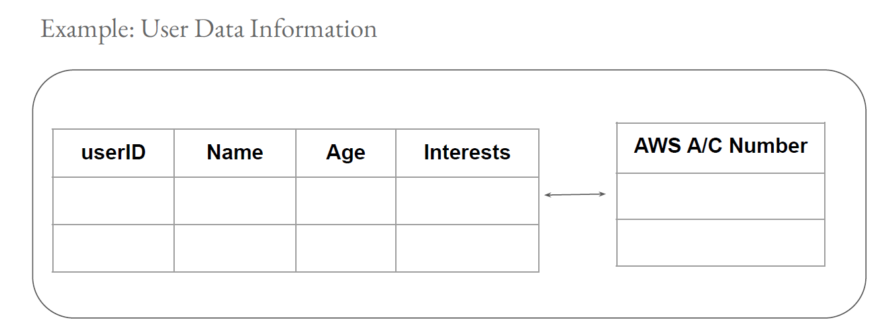
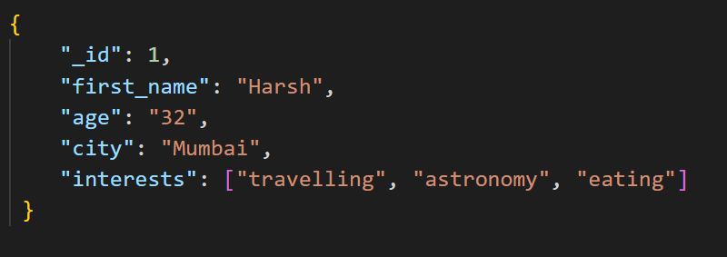
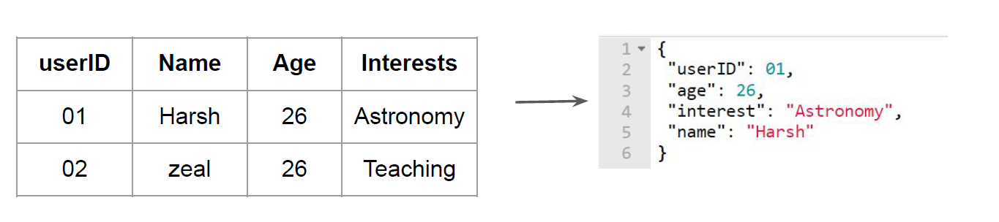

# NoSQL Databases

"Different Type of Database"

## Importance of Schema Free Structure

In a traditional schema database like MySQL, before you start to add data in it, you must first
define the structure of those records.

## Schema Free Database

On Schema Free databases like MongoDB (NoSQL), you can simple add records without any
previous structure.

We can easily group records that do not have a same structure

## Basics of NoSQL Database

NoSQL databases ("not only SQL") are non-tabular databases and store data differently than
relational tables.

NoSQL have gained huge popularity because they are simpler to use, flexible and can achieve
performance that are very difficult with traditional relational databases.

## Advantages of NoSQL Database

There are lot of advantages of NoSQL database over standard relational databases :

- Schema Free

- Horizontal Scaling

- Easy Replication

- Can manage huge amount of data.
