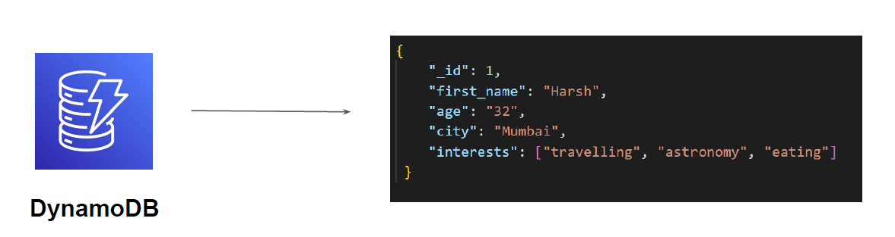

# Basics of DynamoDB

"Storing data NoSQL Way"

## Introduction

DynamoDB is a fully managed NoSQL database service by AWS.

Being managed service, it simplifies lots of operations like hardware provisioning, setup and
configurations, patching, replication, clustering etc for the users.

