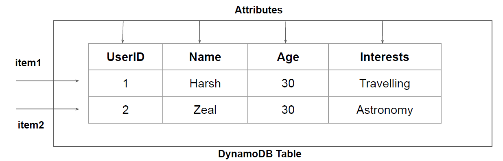

# Core Components - DynamoDB

## Understanding the Basics

In DynamoDB, tables, items, and attributes are the core components that you work with.

Table is a collection of items, and each item is a collection of attributes.

## Importance of Primary Key

Each item in the table has a unique identifier, or primary key, that distinguishes the item from
all of the others in the table

Other than the primary key, the table is schemaless, which means that neither the attributes nor
their data types need to be defined beforehand.

