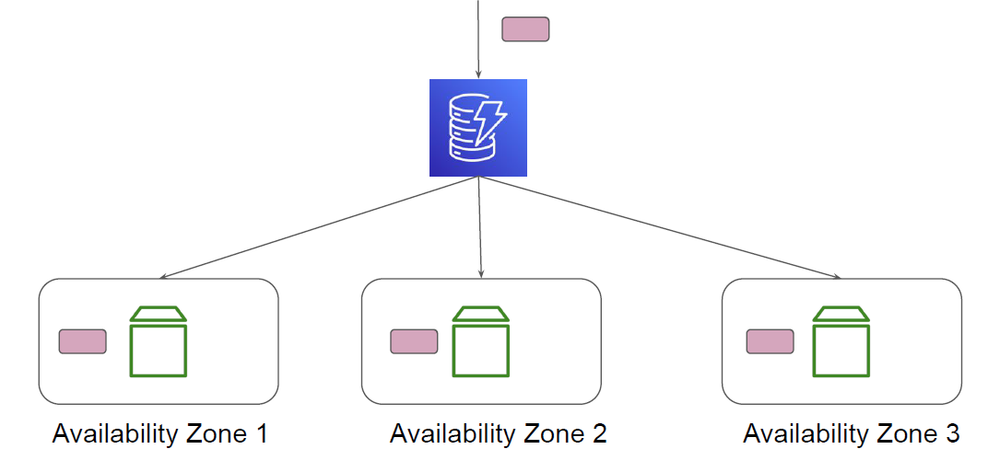
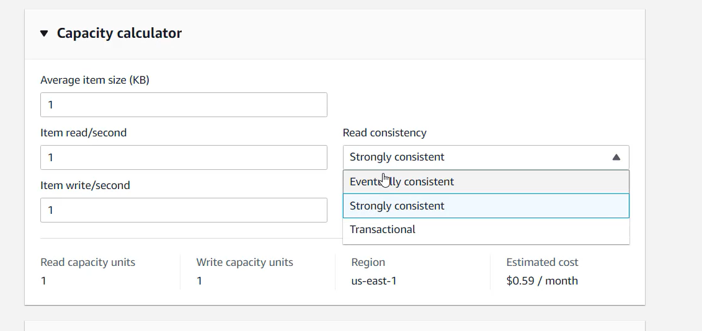

# Consistency Model

"Important Storage Concept"

## Understanding Consistency Model

In DynamoDB, all of your data is stored on SSDs and is automatically replicated across
multiple Availability Zones in an Amazon Region, providing built-in high availability and
data durability.

<div align="center">

</div>

## Consistency Timeline

When your application writes data to a DynamoDB table and receives an HTTP 200
response (OK), the write has occurred and is durable.

The data is eventually consistent across all storage locations, usually within one second or
less.

## Eventual Consistency Reads

When you read data from a DynamoDB table, the response might not reflect the results of
a recently completed write operation.

The response might include some stale data.

If you repeat your read request after a short time, the response should return the latest
data.

## Strong Consistency Reads

When you request a strongly consistent read, DynamoDB returns a response with the
most up-to-date data, reflecting the updates from all prior write operations that were
successful.

1. A strongly consistent read might not be available if there is a network delay or
outage. In this case, DynamoDB may return a server error (HTTP 500).

2. Strongly consistent reads may have higher latency than eventually consistent reads.

3. Strongly consistent reads use more throughput capacity than eventually consistent
reads.

<div align="center">

</div>

## Important Note

DynamoDB uses eventually consistent reads, unless you specify otherwise.

Read operations (such as GetItem, Query, and Scan) provide a ConsistentRead
parameter. If you set this parameter to true, DynamoDB uses strongly consistent reads
during the operation.

Example Command:

```
aws dynamodb get-item --table-name MusicCollection --key file://key.json
--consistent-read
```
