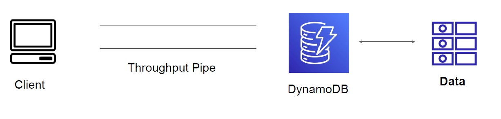
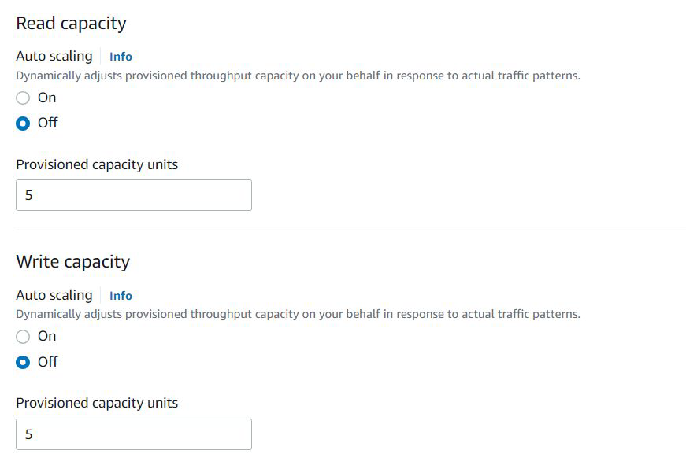

# Read/Write Capacity Units

## Throughput in DynamoDB

Throughput is the maximum amount of capacity that an application can consume from a
table or index

## Setting the Read & Write Capacity

We can specify throughput capacity in terms of read capacity units (RCUs) and write
capacity units.

## Read Request Unit

One read request unit represents one strongly consistent read request, or two eventually
consistent read requests, for an item up to 4 KB in size.

If you need to read an item that is larger than 4 KB, DynamoDB needs additional read
request units.

| Item Size | Read Capacity Unit (Strong) | Read Capacity Unit (Eventual) |
|-----------|-----------------------------|-------------------------------|
| 4 KB | 1 | 1 |
| 8 KB | 2 | 1 |
| 10 KB | 3 | 2 |

## Write Request Unit

One write request unit represents one write for an item up to 1 KB in size.

If you need to write an item that is larger than 1 KB, DynamoDB needs to consume
additional write request units.

| Item Size | Write Capacity Unit |
|-----------|---------------------|
| 1 KB | 1 |
| 4 KB | 4 |
| 10 KB | 10 |
