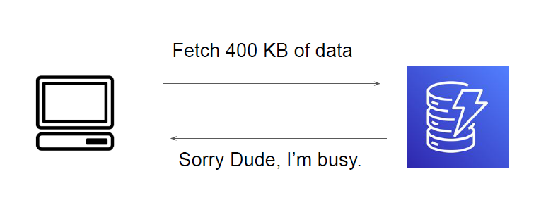
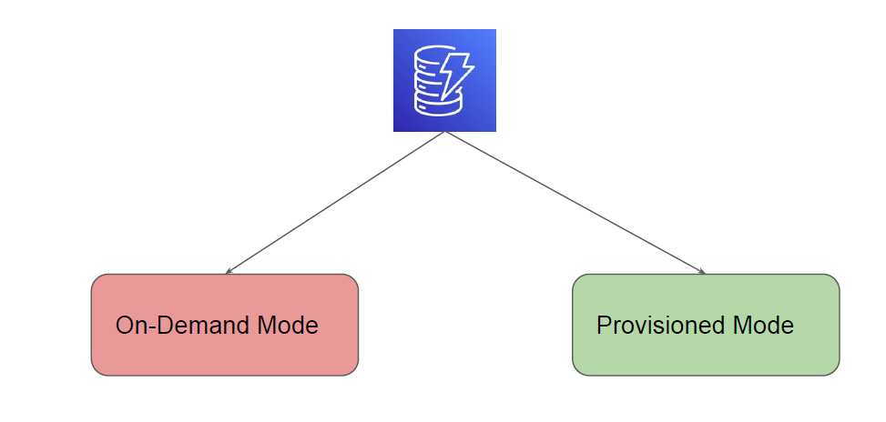
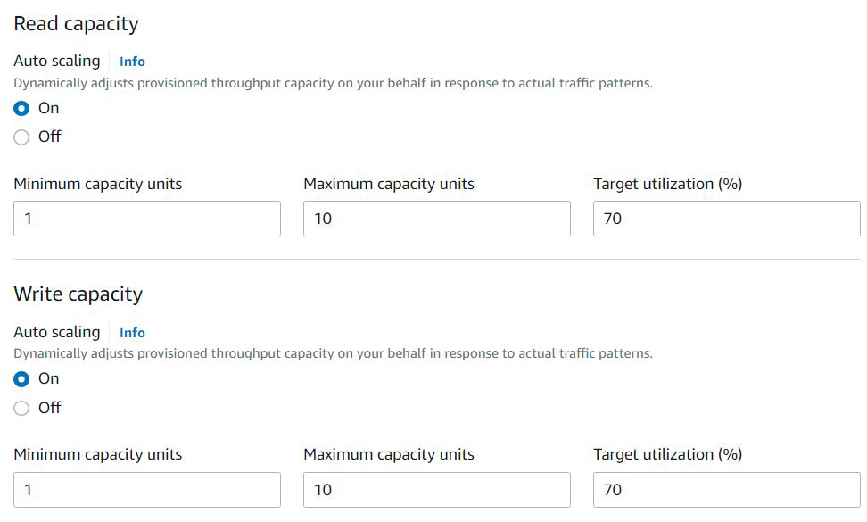

# Capacity Modes in DynamoDB

"Adjust Throughput Automatically"

## Understanding the Challenge

We can specify throughput capacity in terms of read capacity units (RCUs) and write capacity
units

If your application exceeds your provisioned throughput capacity on a table or index, it is
subject to request throttling.

## Types of Capacity Modes

There are two primary capacity modes available in DynamoDB.

## Provisioned Mode

If you choose provisioned mode, you specify the number of reads and writes per second that you
require for your application.
You can use auto scaling to adjust your table’s provisioned capacity automatically in response to
traffic changes.

## Recommended Traffic Patterns for Provisioned Mode

Provisioned mode is a good option if any of the following are true:

● You have predictable application traffic.

● You run applications whose traffic is consistent or ramps gradually.

● You can forecast capacity requirements to control costs.

## On-Demand Mode

Amazon DynamoDB on-demand is capable of serving thousands of requests per second
without capacity planning.

DynamoDB on-demand offers pay-per-request pricing for read and write requests so that you
pay only for what you use.

